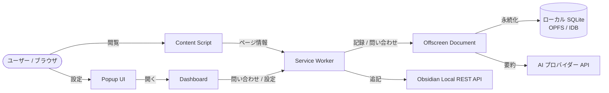
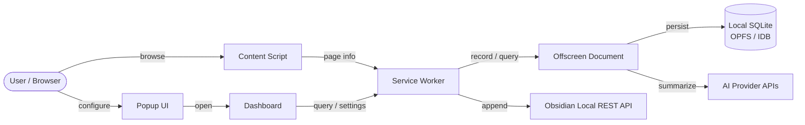

# Yasumaro - AI Browsing Logger

[日本語](#日本語) | [English](#english)

<p align="center">
  <a href="https://chromewebstore.google.com/detail/yasumaro-ai-browsing-logg/cpeammcnmfpmlkidciiobmnjnhfkmjlc" target="_blank" rel="noopener">
    
  </a>
  <a href="https://github.com/armaniacs/yasumaro">
    
  </a>
</p>

---

## 日本語

### 概要
ブラウザの閲覧履歴を、AIによる要約付きでObsidianのデイリーノートに自動保存するChrome拡張機能です。

### オリジナルの Obsidian Smart History について
Yasumaroは、[こちらの記事](https://note.com/izuru_tcnkc/n/nd0a758483901)で紹介されている Obsidian Smart History をフォークして作成しました。シンプルながら実用的なアイデアを形にしてくれたオリジナル作者に感謝します。

### なぜこのプロジェクトを続けているのか

フォークの最初のきっかけは、ごく単純な不満でした。オリジナルはGemini APIのみに対応しており、GroqやOllama、さくらのAIエンジンといったOpenAI互換APIを使いたい自分には合わなかったのです。まずはそこを直すつもりでした。

ただ、実際に自分で毎日使い始めると、次から次へと「ここが気になる」が出てきました。手動で今すぐ記録したい、プライベートなページはうっかり残したくない、Obsidianを開いていなくても記録だけは止めたくない——そのひとつひとつに手を入れているうちに、気づけば当初の目的だったAPI対応は全体のごく一部になっていました。

いまのYasumaroは、閲覧履歴をSQLite（OPFS + FTS5）にローカル保存する基盤を持ち、Obsidianを一切セットアップしなくてもMarkdownファイルとして記録を残せます。PIIマスキングやプライベートページの自動検出、監査ログといったプライバシー機能も、実際に自分が「これがないと怖くて使えない」と感じた部分から生まれたものです。日々の変更履歴は [CHANGELOG.md](CHANGELOG.md) にすべて残しています。

自分自身が毎日使うツールだからこそ、手を抜きたくない。それが今もこのプロジェクトを続けている一番の理由です。もし同じように「閲覧履歴を、AIの手を借りて残しておきたい」と思ったことがあるなら、ぜひ使ってみてください。新しいAPIプロバイダーを追加したい場合は [CONTRIBUTING.md](CONTRIBUTING.md) を参照してください。

### アーキテクチャ

Yasumaro は Manifest V3 Chrome 拡張機能として、以下のコンポーネントで構成されています。



- **Content Script**: ページ滞在時間やスクロール深度を測定し、記録対象ページを Service Worker へ通知します。
- **Service Worker**: 拡張機能の中心です。メッセージの中継、記録パイプラインの起動、Obsidian / SQLite との連携を行います。
- **Offscreen Document**: SQLite や AI 要約など、Service Worker では実行できない DOM / Web API が必要な処理を担当します。
- **Popup / Dashboard**: ユーザー設定、履歴検索、診断情報などの UI を提供します。
- **Obsidian Local REST API**: 既存のデイリーノートへ追記する際に使用されます（任意）。

### 特徴
無料・オープンソースで、これだけの機能が使えます。

- 🤖 **AIによる要約**: OpenAI互換APIまたはGemini APIを使用して、ウェブページの内容を簡潔に要約します（Groq、OpenAI、Anthropic、ローカルLLM等に対応）。
- 📝 **Obsidian連携**: 閲覧履歴を直接Obsidianのデイリーノートに保存します。
- 🎯 **スマート検出**: 実際に読んだページのみを保存します（滞在時間とスクロール深度に基づきます）。
- 📂 **整理された保存**: デイリーノート内に専用の「ブラウザ閲覧履歴」セクションを自動作成し、管理します。
- ⚙️ **カスタマイズ可能**: 最小滞在時間、スクロール深度、API設定などを自由に構成できます。

以下は、yasumaroの独自でversion2以降に追加した機能です。

- 🖱️ **手動記録機能**: 「今すぐ記録」ボタンで現在のページを即座に記録できます。重複チェックなしで同じページを複数回記録可能です。
- 📱 **改良されたUI**: メイン画面と設定画面を分離し、⚙アイコンから専用ダッシュボードへ簡単にアクセスできます。
- 🌐 **ドメインフィルター**: ホワイトリスト/ブラックリストで記録するドメインを制御できます。ワイルドカードパターンに対応。
- 🚫 **uBlock Origin形式フィルター**: EasyListなどの既存のuBlockフィルターリストを直接インポートして使用できます。
- ✏️ **AIプロンプトカスタマイズ**: AIへの要約指示プロンプトを自由に編集・保存できます。プロバイダーごとに異なるプロンプトを設定可能。
- 📋 **AIプロンプトプリセット**: 5種類の組み込みプリセット（タグ付き要約・箇条書き・英語要約・技術的観点）から選べます。プリセットを複製してカスタマイズも可能。
- 🔔 **ツールバーバッジ通知**: プライバシーヘッダー検出時はオレンジ `!`、自動保存完了時は青 `◎` がツールバーアイコンに表示されます。ポップアップを開かなくても状態を確認できます。
- 🔒 **プライバシー保護**: 4つのプライバシーモードを選択し、個人情報をマスクしてからAIに送信可能。プライベートページ（銀行・メール等）を自動検出し、誤った記録を防止。
- ⚠️ **プライベートページ確認**: プライベート判定されたページを保存する前に確認ダイアログを表示。キャンセル、今回のみ保存、ドメイン許可、パス許可などの選択肢を提供。
- 📋 **保留ページ管理**: 自動記録中にプライベート判定されたページを一時保留。後から一括保存、ホワイトリスト追加、破棄などの操作が可能。詳細は [PRIVACY.md](docs/PRIVACY.md) を参照。
- 🔐 **マスターパスワード保護**: 設定のエクスポート/インポート時にAES-GCMでファイルを暗号化。APIキーなどの機密情報を安全に移行・バックアップできます。
- 🗄️ **ローカル SQLite 永続化**（OPFS + FTS5 全文検索を `@subframe7536/sqlite-wasm` で両立、Obsidian 不要でも動作）
- 🇯🇵 **日本語全文検索対応**: FTS5 の trigram トークナイザにより日本語（CJK）の部分一致検索が可能（3 文字未満のクエリは LIKE 検索にフォールバック）
- 🔍 **SQLite 診断パネル**: 環境判定（OPFS/FTS5）、不足診断（具体的な対処提示）、コンパイルオプション表示、デバッグモード対応。設定画面の Diagnostics タブで確認可能。
- 🛡️ **プライバシー同意フロー**: 初回起動時に同意確認を表示。3回拒否で永久非表示、その後は制限モード（記録停止）で動作。GDPRに準拠した物理削除（DELETE FROM）対応。
- 📱 **モバイルChrome / OPFS非対応環境対応**: OPFS が使えない端末では `chrome.storage.local` に自動フォールバック。OPFS 復旧時はデータを自動マイグレーション（詳細: [STORAGE_MODES.md](docs/STORAGE_MODES.md)）。
- 📊 **関連グラフ表示**: 記録したページのタグ共起関係をグラフで可視化。ノードをクリックして該当タグのページに自動フィルタ。
- ☁️ **GitHub Gist 連携**: Obsidian と併用して GitHub Gist にクラウド同期可能。複数同期先に対応。
- 🌐 **複数ブラウザ対応**: Chrome、Microsoft Edge、Brave など Chromium 系ブラウザをサポート。

### 必要なもの
- [Obsidian](https://obsidian.md/) と [Local REST API プラグイン](https://github.com/coddingtonbear/obsidian-local-rest-api)（セットアップ手順は [Obsidian連携ガイド](docs/OBSIDIAN_SETUP_GUIDE.md) を参照）
- AIプロバイダー（以下のいずれか）
   - [Groq](https://console.groq.com/keys)（無料枠あり・推奨）
   - [Google Gemini API キー](https://aistudio.google.com/app/apikey)（無料枠あり）
   - [OpenAI](https://platform.openai.com/api-keys)
   - [Anthropic (Claude)](https://console.anthropic.com/)
   - Ollama などのローカルLLM（APIキー不要）

### インストール方法

#### 方法1: Chrome Web Store からインストール（推奨）

1. [Chrome Web Store の Yasumaro ページ](https://chromewebstore.google.com/detail/yasumaro-ai-browsing-logg/cpeammcnmfpmlkidciiobmnjnhfkmjlc) を開きます。
2. 「Chrome に追加」ボタンをクリックします。
3. 確認ダイアログで「拡張機能を追加」をクリックします。
4. ツールバーの Yasumaro アイコンをクリックして設定を開始します。

#### 方法2: ソースからビルド（開発者向け）

1. このリポジトリをクローンまたはダウンロードします:
   ```bash
   git clone https://github.com/armaniacs/yasumaro.git
   cd yasumaro
   ```

2. 依存パッケージをインストールします:
   ```bash
   npm install
   ```

3. 拡張機能をビルドします:
   ```bash
   npm run build
   ```

4. Chromeを開き、`chrome://extensions` にアクセスします。

5. 右上の「デベロッパーモード」を有効にします。

6. 「パッケージ化されていない拡張機能を読み込む」をクリックし、**`dist/chromium-mv3` フォルダ**を選択します。

### 使い方

#### 自動記録
- ウェブページを5秒以上閲覧し、50%以上スクロールすると自動的に記録されます
- 重複URLは記録されません（同じページは1日1回のみ）

#### 手動記録
1. ツールバーの拡張機能アイコンをクリックしてメイン画面を開きます
2. 現在のページ情報が表示されます
3. 「📝 今すぐ記録」ボタンをクリックすると、即座に現在のページが記録されます
4. 手動記録では重複チェックがないため、同じページを何度でも記録できます

> **📌 「それでも記録」機能について**
> ドメインフィルターにブラックリストモードが設定されている場合、ブラックリストに登録されたドメインは自動記録されません。
> しかし、手動記録時に「それでも記録」ボタンが表示され、ドメインフィルターを上書きして記録することができます。
>
> **使用方法:**
> - ブラックリスト登録ドメインで「📝 今すぐ記録」ボタンをクリックすると確認ダイアログが表示されます
> - 「それでも記録」ボタンを選択すると、そのドメインのページのみ記録されます
> - 引き続きそのドメインを記録したい場合は、ドメインフィルターの設定を見直してください（ホワイトリストへの追加やブラックリストからの削除）

### 設定
1. ツールバーの拡張機能アイコンをクリックします。
2. メイン画面の右上にある「⚙」アイコンをクリックしてダッシュボード（設定画面）を開きます。
3. 以下の設定を入力してください：
   - **Obsidian API Key**: ObsidianのLocal REST API設定で取得したキー（詳細な設定手順は [Obsidian連携ガイド](docs/OBSIDIAN_SETUP_GUIDE.md) を参照）
   - **Protocol/Port**: Obsidian Local REST APIのプロトコルとポート（通常はhttps/27124）
   - **Daily Notes Path**: デイリーノートの保存先フォルダ（例: `092.Daily`）
   - **AI Provider**: 使用するAIサービスを選択（Gemini、OpenAI互換など）
   - **各AIプロバイダーのAPIキーとモデル設定**
4. 「Save & Test Connection」をクリックし、「Test Connection」で接続を確認してください。

#### ドメインフィルター設定
設定画面の「ドメインフィルター」タブで、記録するドメインを制御できます：

- **無効**: すべてのドメインを記録します
- **ホワイトリスト**: 指定したドメインのみ記録します
- **ブラックリスト**: 指定したドメインを除外して記録します

ドメインリストではワイルドカードも使用できます（例: `*.example.com`）。「現在のページドメインを追加」ボタンで簡単にドメインを追加できます。

#### AIプロンプトのカスタマイズ

設定画面の「AIプロンプト」タブで、AI要約時のプロンプトをカスタマイズできます。プロバイダーごとに異なるプロンプトを設定したり、複数のプロンプトを保存して切り替えたりすることができます。

デフォルトのプロンプト、各設定項目の説明、カスタマイズ例は [USER-GUIDE-AI-PROMPT.md](docs/USER-GUIDE-AI-PROMPT.md) を参照してください。

#### uBlock Origin形式フィルターの使用
設定画面の「ドメインフィルター」タブで、「フィルター形式」を「uBlock Origin 形式」に切り替えることで、uBlock Origin形式のフィルターリストを使用できます。

フィルターの入力方法:
- テキストエリアに直接uBlock形式のフィルターを貼り付ける
- ローカルの.txtファイルから読み込む
- ドラッグ＆ドロップでファイルを読み込む
- URLからフィルターリストをダウンロードする

詳細な使い方は [USER-GUIDE-UBLOCK-IMPORT.md](docs/USER-GUIDE-UBLOCK-IMPORT.md) を参照してください。

### Obsidianへの追加の仕組み（`src/background/obsidianClient.ts`）

**方式: Read-Modify-Write（読み込み → 加工 → 書き込み）**

1. **保存先の特定**
   設定された「Daily Note Path」と現在の日付から、保存先ファイルパスを特定します（例: `092.Daily/2026-01-15.md`）。

2. **既存ノートの読み込み (GET)**
   Obsidian Local REST API を使用して、そのファイルの現在の内容をテキストとして取得します。

3. **内容の追記**
   ファイル内に `# 🌐 ブラウザ閲覧履歴` という見出しを探します。
   - **見出しがある場合**: そのセクションの末尾（次の見出しの手前）に新しい要約を挿入します。
   - **見出しがない場合**: ファイルの末尾に新しい見出しを作成し、そこに追記します。

4. **ノートの更新 (PUT)**
   加工した全体の内容でファイルを上書き保存します。

> **注意**: ファイル全体を取得して書き直す方式のため、Obsidian 側でまさにその瞬間に同じファイルを編集していると、競合により更新内容が失われるリスクがわずかにあります（通常の使用では稀です）。

---

## English

### Overview
A Chrome extension that automatically saves your browsing history to Obsidian with AI-generated summaries.

### About the Original — Obsidian Smart History
Yasumaro is a fork of Obsidian Smart History, introduced in [this article](https://note.com/izuru_tcnkc/n/nd0a758483901). Credit goes to the original author for a simple, genuinely useful idea.

### Why I Keep Building This

The fork started from a small frustration: the original only supported Gemini, and I wanted to use OpenAI-compatible APIs like Groq, Ollama, and Sakura AI Engine. That was the whole plan.

Then I actually started using it every day, and one small annoyance led to another. I wanted to record a page right now, not wait for the auto-detection. I didn't want private pages accidentally saved. I wanted history to keep working even when Obsidian wasn't open. Fixing each of those, one at a time, quietly turned the original API-compatibility goal into a small fraction of what the project became.

Today, Yasumaro persists your browsing history locally in SQLite (OPFS + FTS5), and can write daily Markdown files without any Obsidian setup at all. The privacy features — PII masking, automatic private-page detection, the audit log — all came from moments where I thought "I wouldn't trust this without that." Every change along the way is recorded in [CHANGELOG.md](CHANGELOG.md).

I use this tool myself, every day, so I don't want to cut corners on it. That's really the whole reason I keep working on it. If you've ever wanted your browsing history to turn into something worth keeping, with a little help from AI, give it a try. If you'd like to add another API provider, see [CONTRIBUTING.md](CONTRIBUTING.md).

### Architecture

Yasumaro is built as a Manifest V3 Chrome extension with the following components:



- **Content Script**: Measures dwell time and scroll depth, then notifies the Service Worker of recordable pages.
- **Service Worker**: The extension core. It relays messages, starts the recording pipeline, and coordinates Obsidian / SQLite access.
- **Offscreen Document**: Handles DOM / Web API operations that a Service Worker cannot perform, such as SQLite queries and AI summarization.
- **Popup / Dashboard**: Provides the settings UI, history search, and diagnostics.
- **Obsidian Local REST API**: Used when appending to existing daily notes (optional).

### Features
Free and open source, with all of the following built in.

- 🤖 **AI-Powered Summaries**: Automatically generates concise summaries of web pages using OpenAI-compatible APIs or Google's Gemini API (supports Groq, OpenAI, Anthropic, local LLMs, and more)
- 📝 **Obsidian Integration**: Saves browsing history directly to your Obsidian daily notes
- 🎯 **Smart Detection**: Only saves pages you actually read (based on scroll depth and time spent)
- 📂 **Organized Storage**: Automatically creates and maintains a dedicated "Browser History" section in your daily notes
- ⚙️ **Customizable**: Configure minimum visit duration, scroll depth, and API settings

The following features were added exclusively in Yasumaro from version 2 onwards:

- 🖱️ **Manual Recording**: Record any page instantly with the "Record Now" button. No duplicate URL restrictions - record the same page multiple times.
- 📱 **Improved UI**: Separated main screen and settings with easy hamburger menu access.
- 🌐 **Domain Filtering**: Control which domains to record with whitelist/blacklist support. Wildcard patterns supported.
- 🚫 **uBlock Origin Format Filters**: Import and use existing uBlock filter lists like EasyList directly.
- ✏️ **AI Prompt Customization**: Edit and save custom AI summarization prompts. Configure different prompts per provider.
- 📋 **AI Prompt Presets**: Choose from 5 built-in presets (With Tags, Bullet Points, English Summary, Technical). Duplicate any preset to customize it.
- 🔔 **Toolbar Badge Notifications**: An orange `!` badge appears when privacy headers are detected; a blue `◎` badge appears when auto-recording completes. Check status without opening the popup.
- 🔒 **Privacy Protection**: Select from 4 privacy modes and mask PII before sending to AI. Automatically detects private pages (banking, email, etc.) to prevent accidental recording.
- ⚠️ **Private Page Confirmation**: Shows confirmation dialog when saving private pages detected by header analysis. Options include Cancel, Save once, Allow domain, or Allow path.
- 📋 **Pending Pages Management**: Temporarily holds pages marked private during auto-recording. Later you can batch save, add to whitelist, or discard them. See [PRIVACY.md](docs/PRIVACY.md) for details.
- 🔐 **Master Password Protection**: Encrypt exported settings files with AES-GCM. Securely migrate or back up API keys and other sensitive data.
- 🗄️ **Local SQLite Persistence** (OPFS + FTS5 full-text search coexist via `@subframe7536/sqlite-wasm`, works without Obsidian)
- 🇯🇵 **Japanese full-text search**: FTS5 `trigram` tokenizer enables substring search for Japanese/CJK text (queries shorter than 3 characters fall back to LIKE)
- 🔍 **SQLite Diagnostics Panel**: Environment detection (OPFS/FTS5), deficiency diagnosis with recommended actions, compile options viewer, debug mode. Available in Settings > Diagnostics tab.
- 🛡️ **Privacy Consent Flow**: Consent prompt on first launch. After 3 declines, permanently dismissed and the extension runs in restricted mode (no recording). GDPR-compliant physical deletion (DELETE FROM).
- 📱 **Mobile Chrome / OPFS Fallback**: On devices without OPFS, automatically falls back to `chrome.storage.local`. Data is auto-migrated when OPFS becomes available (see [STORAGE_MODES.md](docs/STORAGE_MODES.md)).

### Requirements
- [Obsidian](https://obsidian.md/) with [Local REST API plugin](https://github.com/coddingtonbear/obsidian-local-rest-api) (see the [Obsidian Integration Guide](docs/OBSIDIAN_SETUP_GUIDE.md) for setup instructions)
- An AI provider (choose one):
   - [Groq](https://console.groq.com/keys) (free tier available, recommended)
   - [Google Gemini API key](https://aistudio.google.com/app/apikey) (free tier available)
   - [OpenAI](https://platform.openai.com/api-keys)
   - [Anthropic (Claude)](https://console.anthropic.com/)
   - Local LLMs like Ollama (no API key required)

### Installation

#### Option 1: Install from Chrome Web Store (Recommended)

1. Open the [Yasumaro page on Chrome Web Store](https://chromewebstore.google.com/detail/yasumaro-ai-browsing-logg/cpeammcnmfpmlkidciiobmnjnhfkmjlc).
2. Click "Add to Chrome".
3. Click "Add extension" in the confirmation dialog.
4. Click the Yasumaro icon in your toolbar to start configuring.

#### Option 2: Build from Source (For Developers)

1. Clone or download this repository:
   ```bash
   git clone https://github.com/armaniacs/yasumaro.git
   cd yasumaro
   ```

2. Install dependencies:
   ```bash
   npm install
   ```

3. Build the extension:
   ```bash
   npm run build
   ```

4. Open Chrome and navigate to `chrome://extensions`

5. Enable "Developer mode" in the top right

6. Click "Load unpacked" and select the **`dist/chromium-mv3` folder**

### Usage

#### Automatic Recording
- Pages are automatically recorded when you browse for 5+ seconds and scroll 50%+ of the page
- Duplicate URLs are not recorded (same page only once per day)

#### Manual Recording
1. Click the extension icon to open the main screen
2. Current page information will be displayed
3. Click the "📝 Record Now" button to instantly record the current page
4. Manual recording has no duplicate restrictions - record the same page multiple times

> **📌 About the "Record Anyway" Feature**
> When domain filter blacklist mode is enabled, blacklisted domains are not automatically recorded.
> However, the "Record Anyway" button appears during manual recording, allowing you to override the domain filter.
>
> **Usage:**
> - Click "📝 Record Now" on a blacklisted domain to see a confirmation dialog
> - Select "Record Anyway" to record that specific page
> - If you want to continue recording that domain, review your domain filter settings (add to whitelist or remove from blacklist)

### Setup
1. Click the extension icon in your toolbar
2. Click the "⚙" icon in the top right to open the Dashboard (settings)
3. Configure settings:
   - **Obsidian API Key**: Key from Obsidian's Local REST API settings (see the [Obsidian Integration Guide](docs/OBSIDIAN_SETUP_GUIDE.md) for detailed setup instructions)
   - **Protocol/Port**: Obsidian Local REST API protocol and port (usually https/27124)
   - **Daily Notes Path**: Folder path for daily notes (e.g., `092.Daily`)
   - **AI Provider**: Select your preferred AI service (Gemini, OpenAI Compatible, etc.)
   - **API keys and model settings for each AI provider**
4. Click "Save & Test Connection" to verify connectivity.

#### Domain Filter Settings
In the "Domain Filter" tab of the settings screen, you can control which domains to record:

- **Disabled**: Record all domains
- **Whitelist**: Only record specified domains
- **Blacklist**: Record all domains except those specified

You can use wildcards in the domain list (e.g., `*.example.com`). Use the "Add Current Domain" button to easily add domains.

#### Customizing AI Prompts

In the "AI Prompt" tab of the settings screen, you can customize the prompts used for AI summarization. Configure different prompts per provider or save multiple prompts to switch between them as needed.

For default prompt values, field descriptions, and customization examples, see [USER-GUIDE-AI-PROMPT.md](docs/USER-GUIDE-AI-PROMPT.md).

#### Using uBlock Origin Format Filters
In the "Domain Filter" tab of the settings screen, switch the "Filter Format" to "uBlock Origin Format" to use uBlock Origin format filter lists.

Ways to input filters:
- Paste uBlock format filters directly into the text area
- Load from a local .txt file
- Drag and drop a file to load
- Download a filter list from a URL

For detailed usage instructions, please refer to [USER-GUIDE-UBLOCK-IMPORT.md](docs/USER-GUIDE-UBLOCK-IMPORT.md).

---

## Privacy & Security / プライバシーとセキュリティ

Yasumaro は、閲覧履歴を AI に送信する前にプライバシーを保護することを最重視しています。

### 日本語

- **PII マスキング**: 氏名、メールアドレス、電話番号、クレジットカード番号などの個人情報を、AI 送信前に自動でマスクします。
- **ローカル処理優先**: 履歴の保存、検索、要約の履歴管理はローカルの SQLite（OPFS + FTS5）で行います。Obsidian 連携も任意です。
- **API キー暗号化**: PBKDF2 + AES-GCM で API キーを暗号化し、`chrome.storage.local` に保存します。
- **プライベートページ検出**: 銀行、メール、管理画面などのプライベートページを自動検出し、保存前に確認ダイアログを表示します。
- **監査ログ**: いつ、どの AI プロバイダーに、どの URL の要約を送信したかを記録します。
- **プライバシー同意フロー**: 初回起動時に同意を取得。3 回拒否すると制限モードで動作します。
- **GDPR 対応**: データ削除は物理削除（`DELETE FROM`）で実行します。

詳細は [PRIVACY.md](docs/PRIVACY.md) と [PII_FEATURE_GUIDE.md](docs/PII_FEATURE_GUIDE.md) を参照してください。

### English

- **PII Masking**: Automatically masks personal information such as names, emails, phone numbers, and credit card numbers before sending to AI providers.
- **Local-First Processing**: History storage, search, and summary history are managed in a local SQLite database (OPFS + FTS5). Obsidian integration is optional.
- **API Key Encryption**: API keys are encrypted with PBKDF2 + AES-GCM and stored in `chrome.storage.local`.
- **Private Page Detection**: Automatically detects private pages such as banking, email, and admin panels, and shows a confirmation dialog before saving.
- **Audit Log**: Records when, which AI provider, and which URL summary was sent.
- **Privacy Consent Flow**: Requests consent on first launch. After 3 declines, the extension runs in restricted mode.
- **GDPR Compliance**: Data deletion is performed via physical deletion (`DELETE FROM`).

See [PRIVACY.md](docs/PRIVACY.md) and [PII_FEATURE_GUIDE.md](docs/PII_FEATURE_GUIDE.md) for details.

## License / ライセンス
MIT License

## Documentation / ドキュメント

### 文書一覧
- [AGENTS.md](AGENTS.md) - 開発者向けエージェント設定
- [CHANGELOG.md](CHANGELOG.md) - 更新履歴
- [FAQ.md](docs/FAQ.md) - よくある質問
- [SETUP_GUIDE.md](docs/SETUP_GUIDE.md) - セットアップガイド
- [OBSIDIAN_SETUP_GUIDE.md](docs/OBSIDIAN_SETUP_GUIDE.md) - Obsidian連携ガイド（スクリーンショット付き・トラブルシューティング含む）
- [CONTRIBUTING.md](CONTRIBUTING.md) - コントリビューションガイド
- [LICENSE.md](LICENSE.md) - ライセンス詳細
- [PRIVACY.md](docs/PRIVACY.md) - プライバシーポリシー
- [PII_FEATURE_GUIDE.md](docs/PII_FEATURE_GUIDE.md) - 個人情報保護機能ガイド
- [USER-GUIDE-AI-PROMPT.md](docs/USER-GUIDE-AI-PROMPT.md) - AIプロンプトカスタマイズガイド
- [USER-GUIDE-UBLOCK-IMPORT.md](docs/USER-GUIDE-UBLOCK-IMPORT.md) - uBlockフィルターインポートガイド

### Documentation
- [AGENTS.md](AGENTS.md) - Developer Agent Configuration
- [CHANGELOG.md](CHANGELOG.md) - Changelog
- [FAQ.md](docs/FAQ.md) - Frequently Asked Questions
- [SETUP_GUIDE.md](docs/SETUP_GUIDE.md) - Setup Guide
- [OBSIDIAN_SETUP_GUIDE.md](docs/OBSIDIAN_SETUP_GUIDE.md) - Obsidian Integration Guide (with screenshots and troubleshooting)
- [CONTRIBUTING.md](CONTRIBUTING.md) - Contributing Guide
- [LICENSE.md](LICENSE.md) - License Details
- [PRIVACY.md](docs/PRIVACY.md) - Privacy Policy
- [PII_FEATURE_GUIDE.md](docs/PII_FEATURE_GUIDE.md) - PII Protection Feature Guide
- [USER-GUIDE-AI-PROMPT.md](docs/USER-GUIDE-AI-PROMPT.md) - AI Prompt Customization Guide
- [USER-GUIDE-UBLOCK-IMPORT.md](docs/USER-GUIDE-UBLOCK-IMPORT.md) - uBlock Filter Import Guide

---

## 応援する / Support My Work

このプロジェクトが役に立ったら、コーヒーをおごっていただけると嬉しいです！
If you find this project useful, consider buying me a coffee!

[](https://www.buymeacoffee.com/yasumaro)
