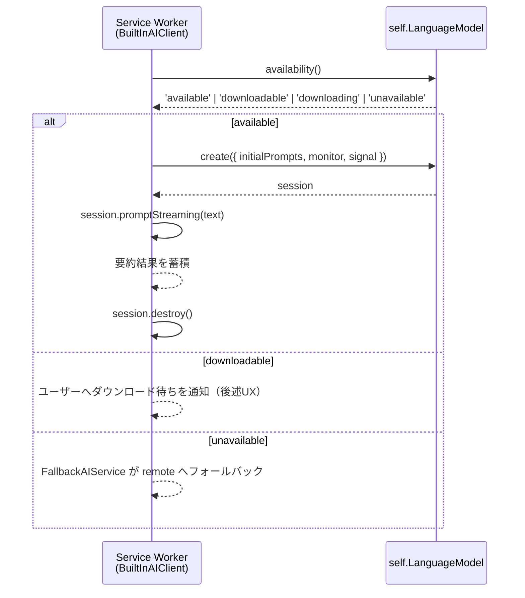

# Built-in AI Provider 統合設計

> PBI: [pbi/2026-07-26-31-feat-built-in-ai-provider-integration-design.md](../pbi/2026-07-26-31-feat-built-in-ai-provider-integration-design.md)
> 前提調査: [dev-docs/2026-07-27-chrome-built-in-ai-oss-research.md](2026-07-27-chrome-built-in-ai-oss-research.md)
> 設計日: 2026-07-28
> 関連ADR: [dev-docs/ADR/2026-07-27-ai-client-service-unification.md](ADR/2026-07-27-ai-client-service-unification.md), [dev-docs/ADR/2026-04-21-ai-provider-abstraction.md](ADR/2026-04-21-ai-provider-abstraction.md)

## サマリー

Chrome Built-in AI（Prompt API / `LanguageModel`）を、Strategy パターン（`AIProviderStrategy` / `AIClient.registerProvider`）ではなく **`AIService` インターフェースの実装として統合する**。理由は2026-07-27 ADRで「新規のAI機能は `AIService` 経由、`AIClient` への新規直接依存は原則禁止」の方針が既に確定しているため。既存の `LocalAIService` は既に `LocalAIClient`（Prompt API）をラップするアダプターとして存在しており、本設計はこの層を刷新する形になる。

| 項目 | 現行実装 | 本設計での変更 |
|---|---|---|
| API呼び出し | `window.ai.languageModel.capabilities()/.create()`（`offscreen.ts`） | `LanguageModel.availability()/.create()` へ刷新 |
| 呼び出し文脈 | Offscreen Document 必須 | Service Worker 直接呼び出しへ移行（フォールバックとして Offscreen 経路を温存） |
| 統合層 | `LocalAIService` が `LocalAIClient` をラップ | 実装を刷新するが `AIService` 契約は変更しない |
| Provider登録 | なし（`AIClient.providers` には未登録） | `AIClient.registerProvider` へは登録しない（ADR方針） |
| UI選択肢 | ダッシュボードに存在しない | 「Built-in AI（APIキー不要）」を追加、優先度リスト対応 |

---

## 1. アーキテクチャ

### 1.1 なぜ `AIService` 経由なのか

2026-07-27 ADR（`ai-client-service-unification.md`）により、以下が確定済み:

- `AIService`（`generateSummary(content, options?)` / `getSupportedModes()`）が全てのAI機能への統一入口
- `AIClient`（Strategy パターン）は Gemini/OpenAI 系の**外部API専用の内部実装**として温存され、新規の直接依存は禁止
- `LocalAIService` は既にこの新方針に沿った実装であり、`FallbackAIService({ local, remote })` の `local` 側を担っている

PBI-31 本文が当初想定していた「`BuiltInAIProvider extends AIProviderStrategy` を `AIClient` に登録する」設計は、この確定済みADR方針と矛盾するため採用しない。

### 1.2 コンポーネント構成

```
createBackgroundServices.ts
  │
  ├── FallbackAIService({ local, remote })
  │     │
  │     ├── local: LocalAIService  ← 本設計の刷新対象
  │     │     └── BuiltInAIClient（刷新後の LocalAIClient 相当）
  │     │           ├── Service Worker 直接呼び出し経路（一次）
  │     │           └── Offscreen Document 経路（フォールバック、後述）
  │     │
  │     └── remote: RemoteAIService
  │           └── AIClient（Strategy: GeminiProvider / OpenAIProvider ...）
```

`LocalAIService` 自体のクラス名・`AIService` 実装契約は変更しない。内部で保持する `LocalAIClient`（Prompt API 呼び出しの実装）を刷新するのが本設計の中心。

### 1.3 既存インターフェースとの整合

- `AIService.generateSummary(content, options?): Promise<AISummaryResult>` — 変更なし
- `AIService.getSupportedModes(): AISummaryMode[]` — `LocalAIService` は引き続き `['local_only']` を返す
- `FallbackAIService` の `mode` 分岐（`local_only` / `full_pipeline` / `masked_cloud` / `auto`）も変更なし

---

## 2. Service Worker 直接呼び出しへの移行設計

### 2.1 実機検証結果の反映（PBI-30・PBI-32着手前追加検証より）

PBI-30の実機検証（Playwright bundled Chromium）で確認済み:

- Service Worker 文脈で `'LanguageModel' in self` は `true`
- `self.LanguageModel.availability()` は権限拒否なく呼び出せる
- `self.LanguageModel.create()` は「サービス未起動」エラー（`NotSupportedError`）で失敗したが、これは検証環境（モデル配信サービス未有効化）に起因する可能性が高く、Service Worker文脈自体の制約ではないと解釈

**2026-07-28 追加検証（完了）**: PBI-32着手前に、実ユーザーのChrome環境（Gemini Nanoモデルダウンロード済み）でYasumaro拡張機能自体のService Worker（`background.js`）コンソール上から以下を実行し、成功を確認した。

```js
await LanguageModel.availability(); // -> 'available'
const session = await LanguageModel.create();
await session.prompt('こんにちは。自己紹介してください。');
// -> 'こんにちは！私はGemmaです。Google DeepMindによってトレーニングされた...' （正常な応答を取得）
```

これにより、「Service Worker直接呼び出しでセッション生成・プロンプト実行が成功する」という本設計の前提が実証された。Offscreen Document経由を廃止する設計方針は確定とする。

### 2.2 新アーキテクチャ: Service Worker 直接呼び出し（一次経路）



**Offscreen Document を経由しない**ため、`localAiClient.ts` の `ensureOffscreenDocument()` / `msgOffscreen()` によるメッセージパッシングの往復（chrome.runtime.sendMessage の30秒タイムアウト含む）が不要になり、レイテンシとコードパスの両方が単純化される。

### 2.3 Offscreen Document 経路の扱い（フォールバック）

`offscreen.ts` は SQLite 操作（`sqlite.js` 経由）でも使われており、Prompt API 専用ファイルではない。したがって：

- **`offscreen.ts` から Prompt API 関連コード（`AICapabilities`/`AISession`/`AILanguageModel`/`getAI`/`checkAvailability`/`ensureSession`/`CHECK_AVAILABILITY`/`SUMMARIZE` メッセージハンドラ）を削除**し、SQLite専用ファイルへ純化する（PBI-30調査で指摘済みのSRP違反の解消）
- Service Worker 直接呼び出しが実環境で失敗するケース（Manifest V3 の将来的な制約変更、フラグ設定の違い等）に備え、**Offscreen 経由のフォールバックコードパスは `BuiltInAIClient` 内部にオプションとして残す**か、実装フェーズの実環境検証結果を見て削除するかを判断する。本設計では「直接呼び出し優先、失敗時は `unavailable` 扱いにしてリモートへフォールバック」という単純化した方針を採用し、Offscreen 経由の二重フォールバックは実装しない（複雑性に見合わないため）。

### 2.4 `BuiltInAIClient`（刷新後の `LocalAIClient`）のインターフェース

```typescript
export type BuiltInAIAvailability = 'available' | 'downloadable' | 'downloading' | 'unavailable';

export interface BuiltInAISummaryResult {
    success: boolean;
    summary?: string;
    error?: string;
    sentTokens?: number;
    receivedTokens?: number;
}

export class BuiltInAIClient {
    async getAvailability(): Promise<BuiltInAIAvailability>;
    async isAvailable(): Promise<boolean>; // status === 'available'
    async summarize(content: string): Promise<BuiltInAISummaryResult>;
}
```

`LocalAIService`（`AIService` 実装）は `BuiltInAIClient` を注入して使う。`createBackgroundServices.ts` の配線変更点は最小限（`LocalAIClient` → `BuiltInAIClient` へのクラス差し替えのみ）。

---

## 3. 長文前処理の仕様

### 3.1 現状の不整合（PBI-30調査より）

- `aiLimits.ts`: `localai` の上限 16,384文字
- `offscreen.ts:467`: `session.prompt()` 直前で **10,000文字にハードコード切り詰め**

この不一致を解消する。

### 3.2 新仕様

1. **静的上限のソース・オブ・トゥルースを `aiLimits.ts` に一本化**する。`BuiltInAIClient` は `getProviderMaxTokens('localai')`（= 16,384）を切り詰め上限として使う。文字数とトークン数は厳密には一致しないが、既存実装も文字数ベースで簡易換算しているため踏襲する。
2. **`session.contextWindow` / `session.contextUsage` による動的管理を追加**する:
   - セッション作成後、`session.contextWindow` を取得しログに記録（診断用）
   - プロンプト送信前に `session.contextUsage` を確認し、静的上限（16,384文字）と `contextWindow` の残り容量の小さい方を実効上限として切り詰める
   - `contextoverflow` イベントをリッスンし、発火した場合は要約結果に警告フラグを付与（古い会話ペアが自動ドロップされたことをログに残す。Built-in AI はシングルターンの要約用途のため、実運用での影響は軽微と想定）
3. **`QuotaExceededError` のハンドリング**: `session.prompt()` が `QuotaExceededError`（`requested`/`contextWindow` プロパティ付き）を投げた場合、`BuiltInAISummaryResult.error` にエラー内容を格納し、`FallbackAIService` が `remote` へフォールバックできるようにする（`success: false` を返すのみで、既存の `AIService` フォールバック機構が自動的に処理する）。

---

## 4. 状態別UX設計

### 4.1 現行4値仕様への対応

PBI本文が前提としていた `after-download` / `no` / `unsupported`（旧3値+α）は、現行仕様の4値 `unavailable` / `downloadable` / `downloading` / `available` に置き換える。

| 状態 | ユーザー通知 | フォールバック動作 |
|---|---|---|
| `unavailable` | 「このブラウザ/デバイスではBuilt-in AIが利用できません（要件: Chrome最新版、22GB以上の空き容量等）」+ ドキュメントへのリンク | `FallbackAIService` が優先度リストの次のプロバイダーへ即座にフォールバック |
| `downloadable` | 「モデルのダウンロードが必要です。要約を実行するとダウンロードが開始されます」 | ユーザーが要約を試行した時点で `create()` を呼びダウンロードを開始（ユーザージェスチャー要件を満たすため、テスト接続ボタン押下時に実行） |
| `downloading` | `monitor` の `downloadprogress` イベントで進捗（%）をダッシュボードの接続テスト結果に表示 | ダウンロード完了まで待つか、即座に次プロバイダーへフォールバックするかはユーザー設定に委ねない（ダウンロード中は毎回 remote へフォールバックし、バックグラウンドでダウンロード完了を待つ） |
| `available` | 通常の要約フローとして動作 | フォールバック不要 |

### 4.2 ダウンロード進捗の扱い

- `monitor(m => m.addEventListener('downloadprogress', e => ...))` を `BuiltInAIClient.summarize()` 内で使い、進捗をコールバックまたはイベント経由でダッシュボードへ伝播する
- Service Worker はステートレスに終了しうるため、ダウンロード進捗はダッシュボードの「接続テスト」実行時にのみ表示する（バックグラウンドでの永続的な進捗表示は行わない。Service Worker のライフサイクル制約と整合）

### 4.3 ダッシュボードUI設計

**Provider選択肢への追加**:

- `src/dashboard/dashboard.ts` の `PROVIDER_LABELS`（`aiClient.ts` からimport）に `'built-in-ai': 'Built-in AI（APIキー不要）'` を追加
  - ただし `PROVIDER_LABELS` は `AIClient.providers`（Strategy登録）と表示ラベルが1対1対応する設計になっている。Built-in AI は `AIClient` に登録しないため、`PROVIDER_LABELS` とは別に、優先度リストのセレクトボックス（`aiProvider`/`aiProviderPriority2`/`aiProviderPriority3`）の `<option>` として `built-in-ai` を追加し、`AIClient.generateSummaryInternal()` 側は素通りさせず、**優先度リスト解決時に `built-in-ai` スロットを検出したら `LocalAIService.generateSummary()` を呼ぶ分岐を `RecordingLogic`/呼び出し元に持たせる**必要がある（詳細は[4.4](#44-優先度リストとの統合方式)参照）
- `updateAIProviderVisibilityMulti` / `updateProviderSettingsLayout`（`aiProviderLayoutManager.ts`）に `built-in-ai` のケースを追加。ただしBuilt-in AIはAPIキー・エンドポイント設定が不要なため、対応する設定パネルdivは「APIキー不要です」という説明文のみを表示する軽量なものにする
- 「API キー不要」であることを選択時に明示するため、専用の設定パネル（例: `#builtInAiSettings`）に固定テキストで表示する（PBI本文の落とし穴で指摘された「設定ミス防止」に対応）

### 4.4 優先度リストとの統合方式

現状 `AIClient.generateSummaryInternal()` は `this.providers.get(slot.provider)`（`AIProviderFactory` map）でスロットを解決しており、`AIService` 層はこの下流にある。Built-in AI を `AIClient` に登録しない以上、優先度リストのスロット解決ロジックには手を入れる必要がある。

2つの統合案を比較する:

| 案 | 概要 | 評価 |
|---|---|---|
| A. `RemoteAIService` 内で `built-in-ai` スロットを特別扱いし、`LocalAIService` へ委譲 | `RemoteAIService.generateSummary()` が優先度リストを走査する際、`slot.provider === 'built-in-ai'` を検出したら自身が保持する `LocalAIService` 参照を呼ぶ | `RemoteAIService` の責務（リモートAPI呼び出し）が曖昧になる。非推奨 |
| B. **`FallbackAIService` を優先度リスト対応に拡張**し、スロット単位で `local`/`remote` を振り分ける | `FallbackAIService` が優先度リスト（`ProviderSlot[]`）を受け取り、`provider === 'built-in-ai'` なら `local.generateSummary()`、それ以外なら `remote.generateSummary()`（内部で `AIClient` が該当スロットのみ処理）を呼ぶよう `mode` 判定ロジックを拡張する | **採用**。`AIService` 契約は変更せず、`FallbackAIService` の内部実装のみ拡張すれば済む |

**採用案（B）の詳細**: `FallbackAIService.generateSummary()` に、優先度リスト全体を渡せるオプション（例: `options.prioritySlots`）を追加検討する、または `RecordingLogic` 側で優先度リストを走査し、スロットごとに `local`/`remote` のどちらの `AIService` を呼ぶか判定してから `FallbackAIService` に渡す設計にする。後者の方が `FallbackAIService` のシンプルさを保てるため、**優先度リストの走査・スロット判定は呼び出し元（`RecordingLogic` 手前、または新設する薄いディスパッチャー）が担い、`FallbackAIService`/`AIClient` 双方の既存ロジックには変更を加えない**方針とする。この分岐点の具体的な実装箇所は実装フェーズで確定する。

---

## 5. 既存優先度リスト・設定管理との整合性

- `ProviderSlot { provider: string; model?: string }` に変更は不要。`provider: 'built-in-ai'` のスロットは `model` を持たない（Gemini Nanoは単一モデルのため）
- `ai_provider` / `ai_provider_priority_list` の後方互換性: 既存ユーザーの設定に `built-in-ai` は存在しないため、マイグレーションは不要（新規の選択肢追加のみ）
- 単一選択モード・優先度リストモードの両UIで `built-in-ai` を選択可能にする（[4.3](#43-ダッシュボードui設計)のUI変更で対応）

---

## 6. 申し送り事項

1. ~~実装フェーズ開始前に実機確認~~ → **2026-07-28に完了**。実ユーザーのChrome環境（モデルダウンロード済み）でYasumaro拡張機能自体のService Workerから `LanguageModel.create()` → `session.prompt()` の成功を確認済み（[2.1章](#21-実機検証結果の反映pbi-30pbi-32着手前追加検証より)参照）。Offscreen Document経由廃止の設計方針は確定
2. `[4.4](#44-優先度リストとの統合方式)` のディスパッチ実装箇所（`RecordingLogic`手前 or 新設ディスパッチャー）は実装フェーズで確定する
3. Extension向け `LanguageModel` が Origin Trial registration を要するか（`manifest.json` への `trial_tokens` 追加要否）の確認は未実施（PBI-30からの継続申し送り）。ただし今回の実機検証でOrigin Trial未設定のまま成功しているため、優先度は下げてよい
4. `Summarizer` API との比較検討（PBI-30で言及）は本設計では見送り、Prompt APIベースの `BuiltInAIClient` を先行実装する。将来的に要約特化APIへの切り替えを検討する余地は残す
5. `reviewSummaryGenerator.ts` は ADR例外規定により `AIClient` を直接生成し続けているため、週次/月次ダイジェストでBuilt-in AIを使う場合の扱いは別PBIで検討する
