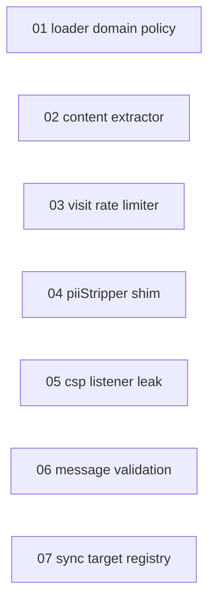

# PBI Backlog — 2026-08-24

Architecture Deepening（Phase 0 診断: 3並列サブエージェントによる background / storage / content・UI 探索）。RICE 降順。すべて `codebase-design` 語彙で評価。

## 順位表（RICE 降順）

| 順位 | PBI | Type | Reach | Impact | Conf | Effort | RICE |
|---|---|---|---|---|---|---|---|
| 1 | [01-refactor-loader-domain-policy](2026-08-24-01-refactor-loader-domain-policy.md) | refactor | 20 | 1 | 0.8 | 0.6 | **26.7** |
| 2 | [02-refactor-content-extractor-fallback](2026-08-24-02-refactor-content-extractor-fallback.md) | refactor | 15 | 2 | 0.8 | 1.25 | **19.2** |
| 3 | [03-refactor-visit-rate-limiter-extraction](2026-08-24-03-refactor-visit-rate-limiter-extraction.md) | refactor | 10 | 1 | 0.8 | 0.5 | **16.0** |
| 4 | [04-refactor-piistripper-shim-removal](2026-08-24-04-refactor-piistripper-shim-removal.md) | refactor | 2 | 1 | 1.0 | 0.2 | **10.0** |
| 5 | [05-fix-csp-settings-listener-leak](2026-08-24-05-fix-csp-settings-listener-leak.md) | fix | 5 | 1 | 0.8 | 0.5 | **8.0** |
| 6 | [06-refactor-message-validation-collapse](2026-08-24-06-refactor-message-validation-collapse.md) | refactor | 10 | 1 | 0.5 | 0.75 | **6.7** |
| 7 | [07-refactor-sync-target-registry-deletion](2026-08-24-07-refactor-sync-target-registry-deletion.md) | refactor | 1 | 0.5 | 1.0 | 0.2 | **2.5** |

## 依存関係

## 備考
- 全 PBI は独立（相互依存なし）。実装順は RICE 降順。
- 01/03/04/05/07 は低风险・high leverage、06/02 は规模大・中风险。
- 各 PBI の DoD チェックボックスを `[x]` にし、検証後に `dev-docs/archived/pbi/` へ移動。
