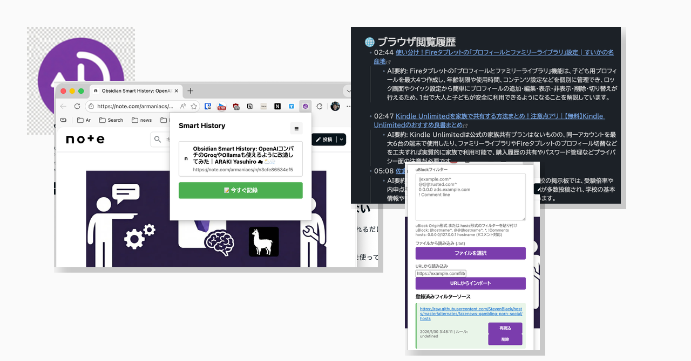
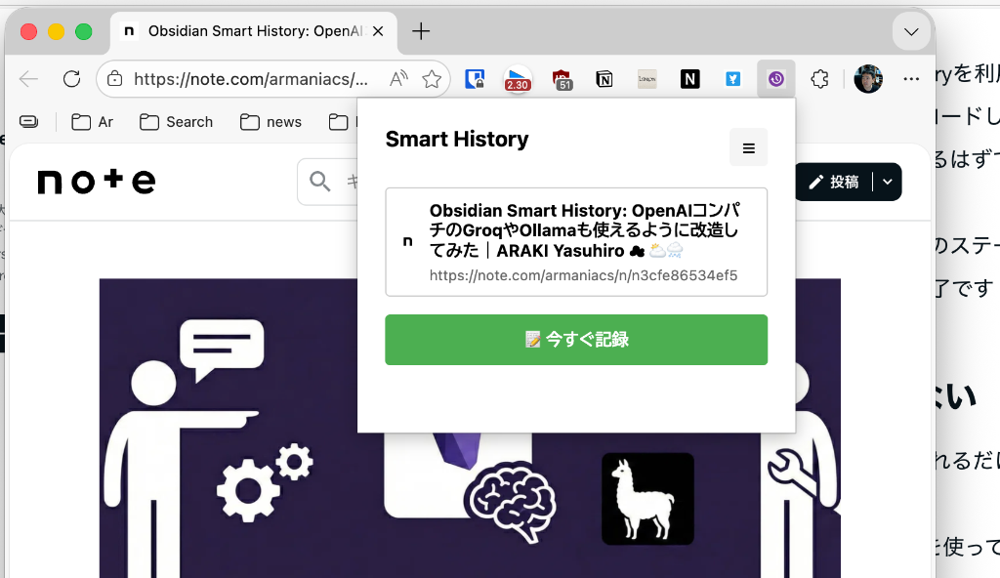
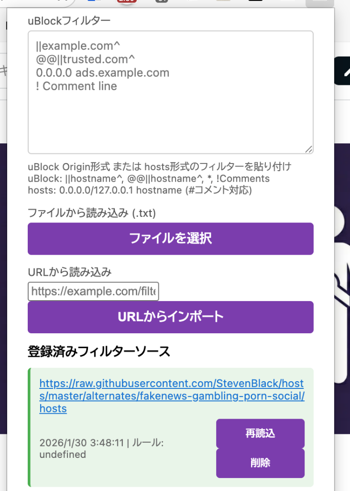

# Obsidian Smart History v2.1-2.2: プライバシー保護機能と高度なフィルタリングを追加

[ARAKI Yasuhiro ☁ ⛅🌨](https://note.com/armaniacs)

前回の「[Obsidian Smart History v2: 手動記録とドメインフィルタリング機能を追加](https://note.com/armaniacs/n/n40391161c8cc)」から間もないですが、早くも v2.1、そして v2.2 への大型アップデートを行いました。
今回のアップデートのテーマは**「プライバシー保護」**と**「パワーユーザー向けの制御」**です。
v2.0 をお使いの方も、より安心して利用できる v2.2 へのアップデートを強くおすすめします。

---

## Obsidian Smart History とは？

初めてこの記事をご覧になる方のために、簡単にご紹介します。

**Obsidian Smart History** は、ブラウザの閲覧履歴を **AIによる要約付きで** Obsidian のデイリーノートに自動保存する Chrome 拡張機能です。


### 主な特徴

- 🤖 **AIによる要約**: Gemini / Groq / Ollama など、お好みのAIで閲覧ページを自動要約
- 🎯 **スマート検出**: 5秒以上閲覧し、50%以上スクロールしたページのみを自動記録
- 🖱️ **手動記録**: 「今すぐ記録」ボタンで任意のタイミングで即座に記録も可能
- 🌐 **ドメインフィルター**: 記録したいドメイン/除外したいドメインをホワイトリスト/ブラックリストで制御



詳しい導入方法は [前回の記事](https://note.com/armaniacs/n/n40391161c8cc) や [GitHub リポジトリ](https://github.com/armaniacs/obsidian-smart-history) をご覧ください。

---

## 追加された新機能

今回 v2.1〜v2.2.2 で追加・強化された主な機能は以下の3点です：

1.  **プライバシー保護スイート** - AIへのデータ送信を制御する4つのモード
2.  **uBlock Origin形式のフィルタリング** - 高度な広告ブロックルールで記録を除外
3.  **プレビュー＆確認UI** - 保存される内容を事前にチェック

---

## 1. プライバシー保護スイート：安心の4つのモード

「閲覧履歴をAIに送るのは便利だけど、プライバシーが気になる」という声にお応えして、データの処理方法を細かく選べるようになりました。

### 4つの動作モード

設定画面の「プライバシー」タブから以下の4つのモードを選択できます：

| モード | 概要 | プライバシー | 精度 |
|--------|------|-------------|------|
| **Mode A: Local Only** | ブラウザ内蔵AIのみ使用（実験的） | ◎ 最高 | △ |
| **Mode B: Full Pipeline** | ローカル＋クラウドAIのハイブリッド | ○ | ◎ 最高 |
| **Mode C: Masked Cloud** | 個人情報をマスクしてクラウドに送信 | ○ | ○ |
| **Mode D: Cloud Only** | 従来動作（そのままクラウドに送信） | △ | ○ |

*   **Mode A: Local Only (Experimental)**
    *   **すべてローカルで完結**します。外部へのデータ送信は一切ありません。
    *   Chromeに組み込まれたAI（Gemini Nano等）を使用します（※ブラウザ側の対応が必要です）。

*   **Mode B: Full Pipeline**
    *   ローカルでの処理に加え、クラウドAIを活用して高品質な要約を行います。
    *   最も精度の高い記録が可能です。

*   **Mode C: Masked Cloud (Recommended)**
    *   **推奨モード**です。筆者も、Mode A（ローカルLLM）は魅力的ですが筆者のブラウザ環境ではサポート外のため、もっぱらこの **Mode C** を愛用しています。
    *   クレジットカード番号、電話番号、メールアドレスなどの個人情報（PII）を**ローカルで自動的にマスク（伏せ字化）**してから、クラウドAIに送信します。
    *   プライバシーを守りつつ、AIの便利さを享受できます。

*   **Mode D: Cloud Only**
    *   従来の動作モードです。

### 個人情報の自動マスキングと確認

Mode Cを選択すると、AIに送信する前に以下のような処理が行われます：

1.  ページ内の個人情報（メールアドレス、電話番号など）を検出。
2.  `[EMAIL_MASKED]` のように自動的に置換。
3.  **確認ポップアップ**を表示し、マスクされた内容をユーザーが確認してから送信。

これにより、「意図せず個人情報がAIに送られてしまう」リスクを大幅に低減できます。

---

## 2. uBlock Origin形式のフィルタリング：プロ仕様の除外設定

v2.0で導入したドメインフィルター（ホワイトリスト/ブラックリスト）を大幅に強化しました。
定評のある広告ブロッカー「uBlock Origin」のルール形式をサポートしました。

### 何ができるようになったか

単純なドメイン指定（`example.com`）やワイルドカード（`*.example.com`）だけでなく、以下のような高度なルールが記述可能です：

*   `||ads.example.com^` （サブドメインを含むブロック）
*   `/banner/` （URLに特定の文字列を含むパスのブロック）
*   `! コメント` （行頭に `!` でコメント記述）

これにより、不要な広告ページやトラッキングURLなどを強力に除外できるようになりました。

### 実践的な活用例：公開フィルタリストの活用

実は、uBlock形式に対応したことで、世界中で公開されているフィルタリストをそのまま活用できます。
例えば、以下のような公開されているフィルタリスト（hostsファイル）を設定画面に登録するだけで、有害なサイトをまとめて記録対象外にできます。

> **筆者のおすすめフィルタリスト**
> [StevenBlack/hosts - fakenews-gambling-porn-social](https://raw.githubusercontent.com/StevenBlack/hosts/master/alternates/fakenews-gambling-porn-social/hosts)

このリストには、fakenews, gambling, porn, social に分類される**16万以上のドメイン**が登録されており、これらを一括で除外することが可能です。筆者の環境でもこのリストを適用して運用しています。



### リストの「再読込」機能 (v2.2.2)

外部のフィルターリストURLを登録している場合、設定画面に「再読込（Reload）」ボタンを追加しました。
最新のルールをワンクリックで取得し、常に最新の状態に保つことができます。

---

## 3. 使い勝手の向上（UI/UX改善）

日常的に使うツールだからこそ、細かい使い勝手にもこだわりました。

*   **ローディング表示**: 記録処理中にスピナーを表示し、「処理中」であることが明確になりました。
*   **自動クローズ**: 記録完了後、2秒でポップアップが自動的に閉じます（設定画面を開いている時を除く）。これにより、記録後の「ポップアップを閉じる」というワンクリックの手間がなくなりました。
*   **マスク情報の可視化**: Mode Cでマスクされた情報の件数が表示され、どの部分がマスクされたかをハイライトで確認できます。

---

## インストール方法

まだ導入していない方のために、改めてインストール方法をご紹介します。

### 必要なもの

1.  **Obsidian** と [Local REST API プラグイン](https://github.com/coddingtonbear/obsidian-local-rest-api)
2.  **AIプロバイダーのAPIキー**（以下から選択）
    *   [Google Gemini API](https://aistudio.google.com/app/apikey)（無料枠あり）
    *   [Groq](https://console.groq.com/keys)（無料枠あり・高速でおすすめ）
    *   [OpenAI](https://platform.openai.com/api-keys)
    *   ローカルLLM（Ollamaなど）

### 手順

1.  [GitHub リポジトリ](https://github.com/armaniacs/obsidian-smart-history) をダウンロード（Code > Download ZIP）またはクローン
2.  Chromeで `chrome://extensions` を開く
3.  右上の「デベロッパーモード」を有効化
4.  「パッケージ化されていない拡張機能を読み込む」をクリックし、解凍したフォルダを選択

```
chrome://extensions
```

設定画面で Obsidian API Key と AIプロバイダーを設定すれば、すぐに使い始められます。

---

## まとめ

v2.0 のリリース後も、ユーザーの皆様や自分自身の「もっとこうしたい」という要望を取り入れ、急速に進化を続けています。

**今回のハイライト:**
- ✅ **Mode C** で個人情報を自動マスクしながらAI要約を活用
- ✅ **uBlock形式フィルター** で16万ドメインを一括除外
- ✅ **自動クローズ** で日常のワンクリックを削減

ぜひ設定画面から新機能を確認してみてください。

---

## リンク

- 📦 **ソースコード**: [GitHub - armaniacs/obsidian-smart-history](https://github.com/armaniacs/obsidian-smart-history)
- 📝 **前回の記事（v2.0）**: [Obsidian Smart History v2: 手動記録とドメインフィルタリング機能を追加](https://note.com/armaniacs/n/n40391161c8cc)
- 📝 **最初の記事（v1.0）**: [Obsidian Smart History: OpenAIコンパチのGroqやOllamaも使えるように改造してみた](https://note.com/armaniacs/n/n3cfe86534ef5)

IssuesやPRもお待ちしています！
