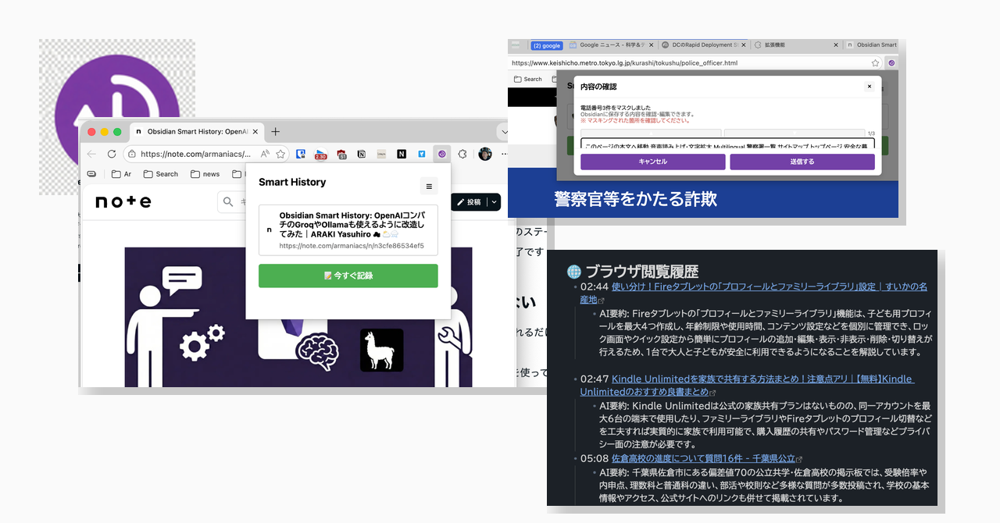
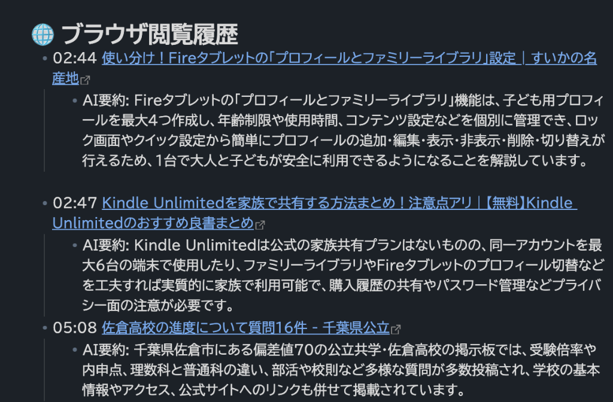
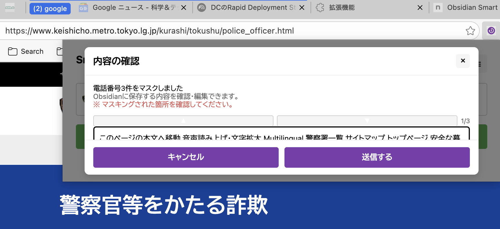

# Obsidian Smart History v2.3: 「確認画面」がもっと便利になりました

[ARAKI Yasuhiro ☁ ⛅🌨](https://note.com/armaniacs)

日常的にWeb閲覧をしていると、「あ、この記事あとで読みたい」「このページの内容をメモに残したい」っていう瞬間ありますよね。

Obsidian Smart Historyを使っていれば、AIが自動的に要約してくれて、Obsidianのデイリーノートに保存されます。便利ですよね。

でも、v2.2の頃、「確認画面がもう少し使いやすくなればいいのに」と感じるシーンがありました。

例えば：
- **「何がマスクされたのか分からない」** - Mode Cを使っていると、個人情報がマスクされるのは嬉しいけど、「何件マスクされた？」「どんな種類の情報？」がさっと分からない
- **「テキストエリアが小さくて読みにくい」** - 内容を確認するのに何度も下にスクロールするのが面倒
- **「マスク箇所がどこにあるか探すのが大変」** - `[MASKED:EMAIL]` のようなトークンが長いテキストの中に散らばっていて、どこにあるか探すのが一苦労

v2.3では、こうした「あるある」という課題を解決しました。

**テーマは「確認画面の UX 改善」。**

---

## Obsidian Smart History とは？

初めてこの記事をご覧になる方のために、簡単にご紹介します。

**Obsidian Smart History** は、ブラウザの閲覧履歴を **AIによる要約付きで** Obsidian のデイリーノートに自動保存する Chrome 拡張機能です。



### 主な特徴

- 🤖 **AIによる要約**: Gemini / Groq / Ollama など、お好みのAIで閲覧ページを自動要約
- 🎯 **スマート検出**: 5秒以上閲覧し、50%以上スクロールしたページのみを自動記録
- 🖱️ **手動記録**: 「今すぐ記録」ボタンで任意のタイミングで即座に記録も可能
- 🌐 **ドメインフィルター**: 記録したいドメイン/除外したいドメインをホワイトリスト/ブラックリストで制御


詳しい導入方法は [前回の記事](https://note.com/armaniacs/n/n40391161c8cc) や [GitHub リポジトリ](https://github.com/armaniacs/obsidian-smart-history) をご覧ください。

---

## 確認画面の「あるある」課題

v2.2 で導入されたプライバシー保護機能（Mode C）は、個人情報をマスクしてからAIに送るので、安心して使えるのが大きな魅力です。

でも、確認画面には以下のような「あるある」がありました。

**課題1: 何がマスクされたのか分からない**
```
「3件の個人情報をマスクしました」
```
このメッセージだけでは、「電話番号？メールアドレス？住所？」という種類が分かりませんでした。

**課題2: テキストエリアが小さくて読みにくい**
デフォルト高さが 200px と小さく、長いテキストだと何度もスクロールする必要がありました。

**課題3: マスク箇所がどこにあるか探すのが大変**
`[MASKED:EMAIL]` や `[MASKED:PHONE]` のようなトークンがテキスト内に散らばっていて、どこにあるか目で探すのが大変でした。

---

## v2.3の3つの改善

### 改善1: マスク種別が一目で分かる

ステータスメッセージに、マスクされた個人情報の種別が表示されるようになりました。

**v2.2:**
```
3件の個人情報をマスクしました
```

**v2.3:**
```
電話番号3件をマスクしました
```

```
E-mail1件、クレジットカード番号2件をマスクしました
```

これで、「電話番号が含まれてたんだ」「クレジットカード番号もマスクされて安心」と、すぐに状況が把握できます。

---

### 改善2: マスク箇所にワンタッチでジャンプ

textarea の右側に **▲ / ▼ ボタン** を追加しました。

これを使うと、`[MASKED:*]` トークンにワンタッチでジャンプでき、自動的に範囲選択されます。

- **▼ ボタン**: 次のマスク箇所に移動
- **▲ ボタン**: 前のマスク箇所に移動

長いテキストの中からマスク箇所を探す手間がなくなりました。「あ、ここに電話番号があったんだ」と、一瞬で確認できます。



---

### 改善3: テキストエリアが自由にリサイズ

textarea の右下にリサイズハンドルを追加しました。以下のように自由にサイズを調整できます。

- **デフォルト高さ**: 600px（v2.2の3倍に拡大）
- **縦横自由にリサイズ**: 右下のハンドルをドラッグ
- **ポップアップ幅に自動追従**: ポップアップのサイズに合わせて、textarea も自動的に調整

これで、「長いテキストでも一度に読み切れる」「画面サイズに合わせて調整できる」ようになりました。

---

## 継続して利用できる新機能

v2.3 は「確認画面の改善」にフォーカしましたが、v2.2 で追加された以下の機能も引き続き利用できます。

### プライバシー保護スイート

| モード | 概要 | プライバシー | 精度 |
|--------|------|-------------|------|
| **Mode A: Local Only** | ブラウザ内蔵AIのみ使用（実験的） | ◎ 最高 | △ |
| **Mode B: Full Pipeline** | ローカル＋クラウドAIのハイブリッド | ○ | ◎ 最高 |
| **Mode C: Masked Cloud** | 個人情報をマスクしてクラウドに送信 | ○ | ○ |
| **Mode D: Cloud Only** | 従来動作（そのままクラウドに送信） | △ | ○ |

**Mode C** は推奨モードで、個人情報をローカルで自動的にマスク（伏せ字化）してから、クラウドAIに送信します。

### uBlock Origin形式のフィルタリング

uBlock Origin のルール形式をサポートし、高度なドメイン除外が可能です。

- `||ads.example.com^` （サブドメインを含むブロック）
- `/banner/` （URLに特定の文字列を含むパスのブロック）

公開されているフィルタリスト（例: [StevenBlack/hosts](https://raw.githubusercontent.com/StevenBlack/hosts/master/alternates/fakenews-gambling-porn-social/hosts)）をそのまま活用できます。

### 使い勝手の向上

- **ローディング表示**: 処理中にスピナーを表示
- **自動クローズ**: 記録完了後、2秒でポップアップが自動的に閉じる

---

## インストール・更新方法

まだ導入していない方のために、改めてインストール方法をご紹介します。

### 必要なもの

1.  **Obsidian** と [Local REST API プラグイン](https://github.com/coddingtonbear/obsidian-local-rest-api)
2.  **AIプロバイダーのAPIキー**（以下から選択）
    -   [Google Gemini API](https://aistudio.google.com/app/apikey)（無料枠あり）
    -   [Groq](https://console.groq.com/keys)（無料枠あり・高速でおすすめ）
    -   [OpenAI](https://platform.openai.com/api-keys)
    -   ローカルLLM（Ollamaなど）

### 手順

1.  [GitHub リポジトリ](https://github.com/armaniacs/obsidian-smart-history) をダウンロード（Code > Download ZIP）またはクローン
2.  Chromeで `chrome://extensions` を開く
3.  右上の「デベロッパーモード」を有効化
4.  「パッケージ化されていない拡張機能を読み込む」をクリックし、解凍したフォルダを選択

```
chrome://extensions
```

すでに導入している方は、GitHub リポジトリから最新版をダウンロードし、同じ手順で再読み込みしてください。

---

## まとめ

v2.3 では、「確認画面」の使い勝手を大幅に改善しました。

**今回のハイライト:**
- ✅ **マスク種別が見える** - 「電話番号3件」のように、何がマスクされたか一目で分かる
- ✅ **マスク箇所にジャンプ** - ▲/▼ボタンでワンタッチでマスク箇所に移動
- ✅ **テキストエリアが使いやすい** - デフォルト高さ3倍、自由にリサイズ可能

日常的に使うツールだからこそ、「一瞬で状況が把握できる」「すぐに確認できる」のような細かい改善が、使い勝手に大きく影響します。

ぜひ設定画面から新機能を確認してみてください。

---

## リンク

- 📦 **ソースコード**: [GitHub - armaniacs/obsidian-smart-history](https://github.com/armaniacs/obsidian-smart-history)
- 📝 **前回の記事（v2.1-2.2）**: [Obsidian Smart History v2.1-2.2: プライバシー保護機能と高度なフィルタリングを追加](https://note.com/armaniacs/n/n40391161c8cc)
- 📝 **v2.0の記事**: [Obsidian Smart History v2: 手動記録とドメインフィルタリング機能を追加](https://note.com/armaniacs/n/n40391161c8cc)

IssuesやPRもお待ちしています！