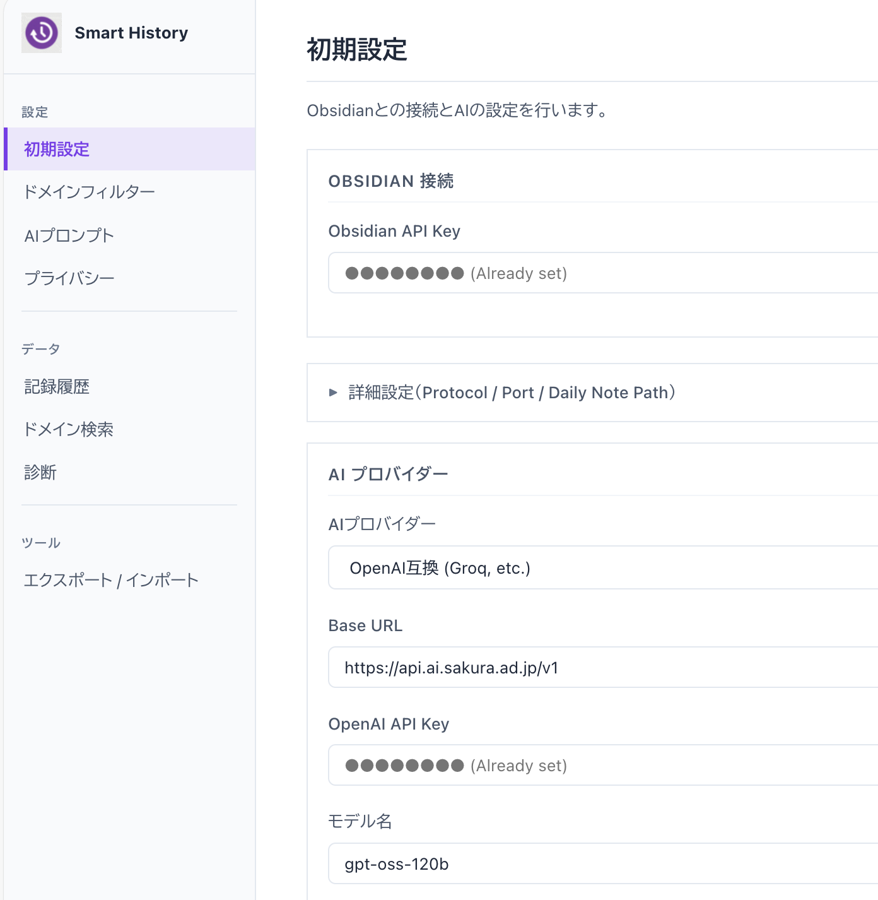
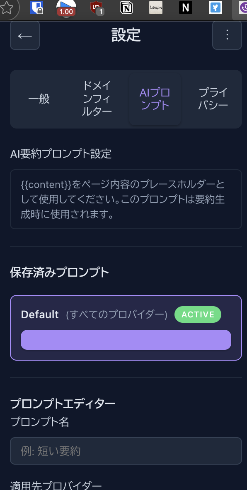
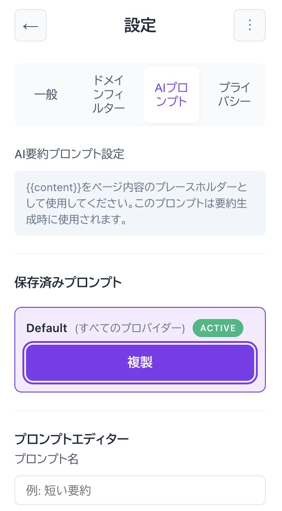
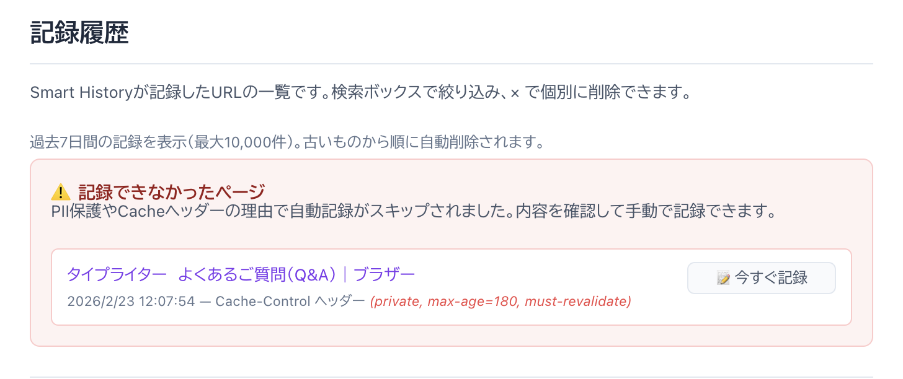
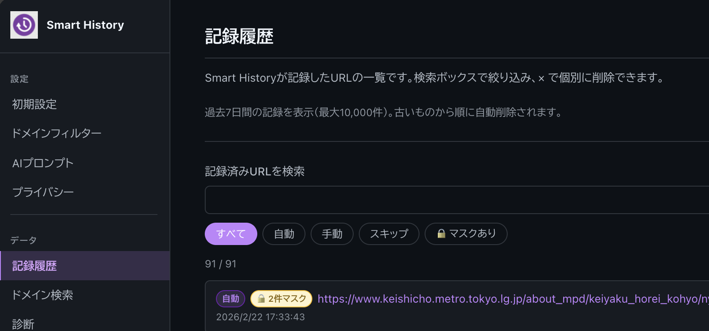

# Obsidian Smart History v4.0 — 設定画面を独立させ、プロンプトとプライバシーを自分で制御できるようにしました

設定項目が増えてきて、ポップアップの中に詰め込むのが限界になってきました。

スクロールしても項目が見えない、クリックが狭くてミスる、設定を変えるたびにポップアップを閉じて開き直す——そういったストレスが積み重なっていたので、v4.0 では設定画面をポップアップから切り離し、独立したダッシュボードとして開くようにしました。

あわせて、ずっと手をつけられていなかった2つの機能を実装しました。**AIプロンプトのカスタマイズ**と、**プライベートページの自動検出**です。

---

## 設定画面がダッシュボードとして独立しました

ポップアップの ⚙ アイコンをクリックすると、新しいタブでダッシュボードが開きます。



設定項目は左サイドバーでカテゴリ別に分かれています。初期設定・ドメインフィルター・AIプロンプト・プライバシー・記録履歴・ドメイン検索・診断・エクスポート/インポート。ポップアップに収まりきらなかった項目が全部並んでいます。

---

## AIプロンプトを自分で書けるようになりました

これまで、AI要約のプロンプトはコードに埋め込まれていました。「もっと短く要約してほしい」「箇条書きで出してほしい」という要望があっても、設定で変えることができなかったんです。

v4.0 からはダッシュボードの「AIプロンプト」タブでプロンプトを自由に作成・管理できます。



デフォルトのプロンプトは編集・削除できません。まず「複製」ボタンで手元にコピーを作り、そこから変えていく設計にしました。いつでも初期状態に戻せるようにするためです。



プロンプトにはプロバイダーを紐付けられます。Gemini専用・OpenAI専用・全プロバイダー共通、どれでも指定できます。技術記事を読むときは詳細な要約、ニュースを読むときは3行にまとめる、という使い分けが可能です。

---

## プライベートページを自動で検出するようになりました

銀行サイトのマイページや社内ポータルを、気づかないうちにObsidianに記録してしまっていました。こういうページは記録したくない、という需要は以前から分かっていたんですが、ようやく実装できました。

v4.0 では、WebサーバーのHTTPレスポンスヘッダーを監視してプライベートページを自動検出します。`Cache-Control: private`、`Set-Cookie`、`Authorization` のいずれかが付いていたら、設定に応じた処理を行います。

### 検出したときの挙動は3段階で選べます

ダッシュボード → Privacy → Confirmation Settings で設定します。

| 設定値 | 動作 |
|--------|------|
| **save**（デフォルト） | そのまま保存する |
| **skip** | 保存をスキップ。Historyの「スキップ」フィルターに残るので、後から手動で保存できる |
| **confirm** | Chrome通知（Save / Skipの2ボタン）が出て、その場で判断できる |

デフォルトを `save` にしたのは、誤検出でページが消えるほうが困るからです。`no-cache` を検出対象に含めなかったのも同じ理由で、「何もしなければ今まで通り」を優先しました。



`skip` 設定でスキップされたページはHistoryに残ります。ページタイトル・URL・検出されたヘッダー値（オレンジ色で表示）が確認でき、「今すぐ記録」ボタンで手動保存もできます。スキップされたページの保持期間は24時間です。

意図的に記録したいドメインは、ドメインフィルターのホワイトリストに登録すると検出をスキップできます。

> 検出するヘッダーの選定理由・`no-cache` を除外した判断の詳細は [tech-4_0.md](tech-4_0.md) をご覧ください。

---

## マスターパスワードで設定ファイルを暗号化できます

設定のエクスポートにはAPIキーが含まれます。これをファイルとして保存・共有するのはリスクがあります。v4.0 から、エクスポート時にマスターパスワードでAES-GCM暗号化できるようにしました。

ダッシュボード → Privacy → 「マスターパスワード保護を有効にする」をオンにしてパスワードを設定するだけです。インポート時に同じパスワードを入力すれば復号されます。パスワードを忘れると復号できないので、ご注意ください。

パスワード設定画面ではリアルタイムで強度を評価します（Weak / Medium / Strong）。パスワード変更時は既存のAPIキーも自動で再暗号化されます。

---

## 記録履歴をダッシュボードで確認できるようになりました

ダッシュボードの「記録履歴」ページから、記録済みURLの一覧を見られるようになりました。



「すべて / 自動 / 手動 / スキップ / 🔒 マスクあり」のフィルターで絞り込めます。

🔒 バッジは、そのページのテキストに電話番号・メールアドレス等のPIIが含まれていたため、AIに送る前にマスクした、という記録です。バッジをホバーすると件数の詳細が確認できます。

記録はリアルタイムで更新されます。ダッシュボードを開いたまま別のページを読んでいても、新しい記録が入ると自動で一覧に追加されます。過去7日間・最大10,000件を保持し、それを超えると古いものから削除されます。

---

## パフォーマンスとアクセシビリティ

**パフォーマンス**の面では、設定読み込みをキャッシュで1/4以下に削減し、ログ書き込みをバッチ処理（10件まとめて書き込み）に変えました。高速スクロール中の負荷も `requestAnimationFrame` で抑えています。

**アクセシビリティ**はWCAG 2.1に準拠しました。フォームラベルの紐付け・セマンティックHTML・モーダルのフォーカストラップ・ARIA属性の追加を行っています。

---

## バグ修正

地味ですが重要なものをいくつか直しました。

- **🔒マスクバッジが消える**: 新しいページを記録すると、既存エントリのバッジが消えていました。ストレージの書き込み時に `maskedCount` フィールドを捨てていたのが原因です。楽観的ロックで書き込む際に既存フィールドを引き継ぐよう修正しました。
- **手動保存でバッジが記録されない**: ポップアップでプレビューしてから「送信する」を押すと、プレビュー時に計算したマスク件数が保存データに引き継がれていませんでした。PREVIEW → SAVE の2段階フローで `maskedCount` をメッセージに乗せて渡すよう修正しました。
- **プライバシーキャッシュのキーミスマッチ**: URLの末尾スラッシュ・フラグメントの扱いが保存時と検索時でズレていてキャッシュが当たらなかった問題を修正しました。

---

## v4.0はビルドが必要になりました

TypeScript完全移行に伴い、v4.0からはビルドが必須になりました。v3系まではソースをそのまま読み込めましたが、今後は `dist/` フォルダをChromeに読み込む形になります。

```bash
# 新規インストール
git clone https://github.com/izuru-tcnkc/obsidian-smart-history.git
cd obsidian-smart-history
npm install
npm run build

# 既存ユーザーの更新
git pull origin main
npm install   # 初回のみ
npm run build
```

ビルド後、`chrome://extensions` で `dist` フォルダを読み込んでください（既存インストール済みなら「更新」ボタンをクリックします）。

TypeScript移行の内部的な話（nodeNext モジュール解決・楽観的ロック・手動保存フローの設計）は [tech-4_0.md](tech-4_0.md) にまとめています。

---

## v4.0の変更まとめ

| カテゴリ | 変更内容 |
|---------|---------|
| **UI** | 設定画面をダッシュボードとして独立 |
| **AIプロンプト** | 複数プロンプトの作成・管理・プロバイダー別切り替え |
| **プライバシー** | プライベートページ自動検出（save/skip/confirm）、🔒PIIマスクバッジ、マスターパスワード保護 |
| **記録履歴** | ダッシュボードで確認・フィルター・リアルタイム更新、7日間保持 |
| **パフォーマンス** | 設定読み込み1/4削減、ログバッチ処理、スクロール最適化 |
| **アクセシビリティ** | WCAG 2.1準拠 |
| **コードベース** | TypeScript完全移行、テスト1160件パス |

---

使っていて気になることがあれば、GitHubのIssueやDiscussionsに書いていただけると嬉しいです。

**GitHub**: [obsidian-smart-history](https://github.com/izuru-tcnkc/obsidian-smart-history)
