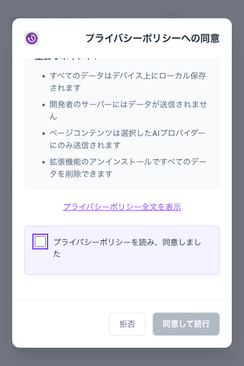

# v4.2 リリースノート: プライバシーポリシー同意UIを追加しました

Obsidian Weave v4.2 では、GDPR/CCPA に対応したプライバシーポリシー同意UIを導入しました。新規ユーザーが拡張機能を初めて開いたとき、機能を使い始める前に明示的な同意を求めるようになります。



---

## なぜ今このUIが必要なのか

ブラウザ拡張機能は、URLや閲覧履歴といったセンシティブな情報を扱います。GDPR（EU 一般データ保護規則）や CCPA（カリフォルニア州消費者プライバシー法）では、こうした情報を処理する前にユーザーの明示的な同意が必要です。

従来の Obsidian Weave は「使い始めたら同意とみなす」という暗黙の設計でした。v4.2 からは、インストール直後に同意モーダルを表示し、「同意した日時」「同意したポリシーバージョン」を `chrome.storage.local` に記録するようにしました。

## 同意フローの仕組み

拡張機能のポップアップが開くと、バックグラウンドで以下の処理が走ります。

```
起動
 └─ 既存ユーザー判定（マイグレーション）
      ├─ プライバシー機能を使用中 → 自動的に同意済みとして扱う
      └─ 新規ユーザー → 同意モーダルを表示
                          └─ チェックボックスにチェック → 「同意する」ボタンが有効化
                               └─ 同意保存 → 通常のポップアップへ
```

モーダルは「拒否」ボタンを押しても再表示されます。同意なしには機能が使えません。ESC キーでモーダルを閉じることもできない設計になっており、フォーカストラップによってタブ移動をモーダル内に限定しています。

## 既存ユーザーへの影響

すでに Obsidian Weave を使っていた場合、アップデート後に同意モーダルが出ることはありません。

起動時に `PRIVACY_MODE`・`PII_CONFIRMATION_UI`・`MASTER_PASSWORD_ENABLED` いずれかの設定値が存在すれば、「プライバシー機能を使っていた」と判断して自動的に同意済みとして移行します（`migrateLegacyPrivacyConsent()` 関数）。

Q. アップデートしたら急に同意を求められた。これはなぜですか？
A. 上記のマイグレーション条件に当てはまらなかった場合です。過去にプライバシー系の設定を一度も触れていなかったユーザーが対象になります。表示された場合は、プライバシーポリシーを確認したうえで同意してください。

## セキュリティ的な背景: `requireConsent()` ガード

同意が必要な機能の呼び出し元では、`requireConsent()` 関数でガードできます。

```typescript
export async function requireConsent(): Promise<void> {
    const hasConsent = await hasPrivacyConsent();
    if (!hasConsent) {
        throw new Error(
            'Privacy consent required. Please accept the privacy policy to use this feature.'
        );
    }
}
```

同意されていない状態でセンシティブな処理を実行しようとすると、エラーをスローして処理を中断します。「UI でブロック」と「コードレベルでブロック」の二重防御です。

## 同意データの構造

同意状態は `chrome.storage.local` に次のオブジェクト形式で保存されます。

```json
{
  "hasConsented": true,
  "consentDate": "2026-03-04T12:00:00.000Z",
  "consentVersion": "2026-02-23"
}
```

`consentVersion` は現在 `"2026-02-23"` が固定値です。将来プライバシーポリシーを改定した際に、バージョンを見て再同意を求める仕組みへ拡張できる設計になっています。

## 多言語対応

同意モーダルは英語・日本語に対応しています。`_locales/en/messages.json` と `_locales/ja/messages.json` に次のキーが追加されました。

| キー | 日本語 |
|------|--------|
| `privacyConsentTitle` | プライバシーポリシーへの同意 |
| `viewFullPolicy` | プライバシーポリシー全文を表示 |
| `consentRequired` | この拡張機能を使用するにはプライバシーポリシーへの同意が必要です |

---

今回のUIは「表示するだけ」ではなく、機能を実際にブロックする設計にしました。ブラウザ拡張機能のプライバシー対応を考えている方の参考になれば幸いです。

次の記事では、同じ v4.2 で追加された AIプロンプトプリセット機能を紹介します。
