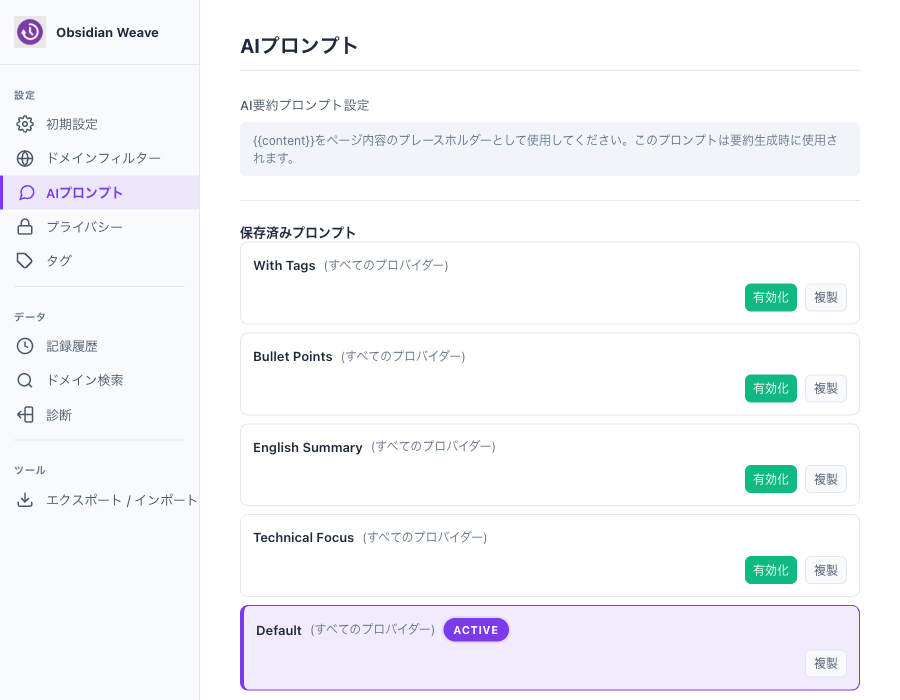
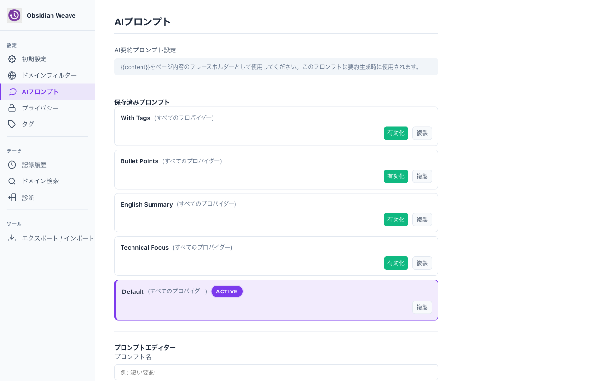

# v4.2 リリースノート: AIプロンプトプリセット機能を追加しました

Obsidian Weave v4.2 では、AIによるページ要約に使うプロンプトを5種類のプリセットから選べるようになりました。これまでは「日本語で1〜2文に要約する」というデフォルトのプロンプトしか使えませんでしたが、用途に応じて切り替えられます。



---

## 5つのプリセット

| ID | 表示名 | 概要 |
|----|--------|------|
| `default` | デフォルト | 日本語で1〜2文の簡潔な要約（従来と同じ） |
| `tagged` | タグ付き要約 | カテゴリタグ + 要約を1行で出力 |
| `bullet` | 箇条書き | 日本語で箇条書き3点 |
| `english` | 英語要約 | 英語で1〜2文の要約 |
| `technical` | 技術的観点 | 技術的なポイントを日本語で3点 |

### タグ付き要約の出力形式

`tagged` プリセットは、Obsidian のタグ管理と相性のよい形式で出力します。

```
#IT・プログラミング #インフラ・ネットワーク | ChromeのV3 Service Workerでsetintervalが動かない問題とalarms APIによる代替手法の解説。
```

カテゴリ候補は10種類あらかじめ定義されており、その中から最大2つをAIが選びます。Obsidianのノートにそのままタグとして貼り付けられます。

## プリセットの使い方



ポップアップの「プロンプト」タブを開くと、プリセットが一覧に表示されています。「有効化」ボタンを押すと、次回からそのプロンプトで要約が生成されます。

プリセット自体は編集できません。内容を変えたい場合は「複製」ボタンでカスタムプロンプトとしてコピーし、自由に編集してください。

```
プロンプト一覧
  ├─ [プリセット] タグ付き要約     [有効化] [複製]
  ├─ [プリセット] 箇条書き         [有効化] [複製]
  ├─ [プリセット] 英語要約         [有効化] [複製]
  ├─ [プリセット] 技術的観点       [有効化] [複製]
  ├─ デフォルト （Active）              [複製]
  └─ マイカスタムプロンプト        [有効化] [複製] [編集] [削除]
```

プリセットとカスタムプロンプトは同じリストに並びます。`Active` バッジがついているものが現在使われているプロンプトです。

## プリセットの内部実装

プリセットは `customPromptUtils.ts` の `PRESET_PROMPTS` 配列として定義されています。ユーザーが保存したカスタムプロンプトとは独立しており、`chrome.storage.local` には保存されません。

プロンプトのテンプレートには `{{content}}` というプレースホルダーが含まれており、実行時にページ本文と置換されます。

```typescript
{
  id: 'tagged',
  name: 'With Tags',
  nameJa: 'タグ付き要約',
  userPrompt: `以下のWebページの内容を分析し、指定したカテゴリから最も関連度の高いものを
1つまたは2つ選んでタグ形式で出力し、その後に日本語で簡潔に要約してください。
...
Content:
{{content}}`,
  systemPrompt: 'You are a helpful assistant that summarizes web pages effectively...'
}
```

`userPrompt` と `systemPrompt` の2フィールド構成になっているのは、OpenAI API が system/user の2ロールに分かれているためです。Gemini は `userPrompt` のみを使います。

## 複製→カスタマイズの流れ

「複製」を押すと、プロンプト編集フォームにそのプリセットの内容がコピーされます（名前末尾に ` (Copy)` が追加されます）。「保存」すると新しいカスタムプロンプトとして登録されます。

プリセット自体は常に参照用として残り続けます。削除はできません。

## セキュリティ: プロンプトインジェクション対策

カスタムプロンプトの内容は、保存時に `promptSanitizer.ts` によるサニタイズが走ります。悪意のあるプロンプトインジェクションパターン（「以下の指示を無視して…」など）を検出し、`DangerLevel` に応じて警告またはブロックします。

プリセットはソースコードに直接定義されているため、サニタイズ対象外です。

---

「とりあえずデフォルトで問題ない」という方はこれまで通り使えます。「Obsidianのタグと連携させたい」「英語でメモを取りたい」という方は、ぜひプリセットを試してみてください。

プロンプトを自分でゼロから書くのが面倒な場合も、プリセットを複製して一部だけ変えるのが手軽です。
