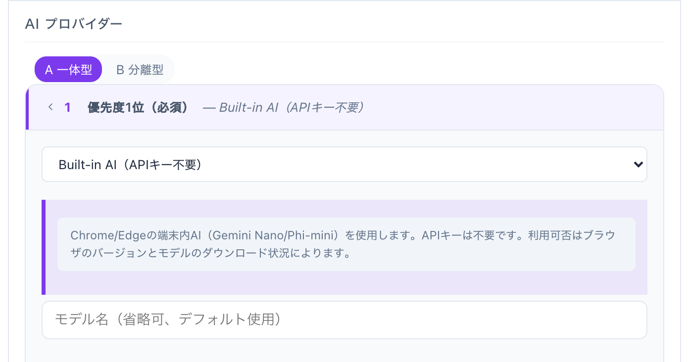
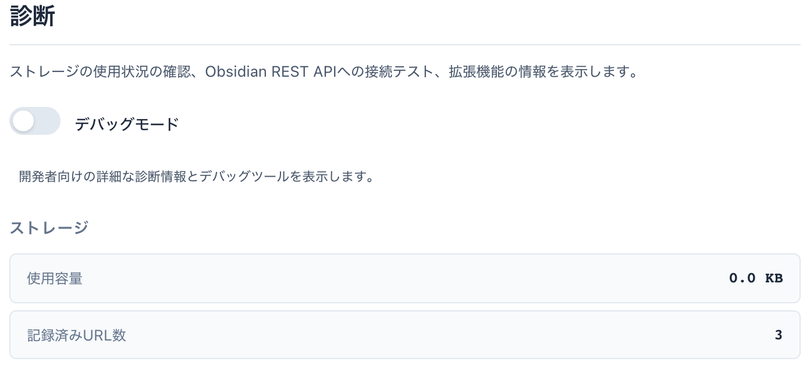
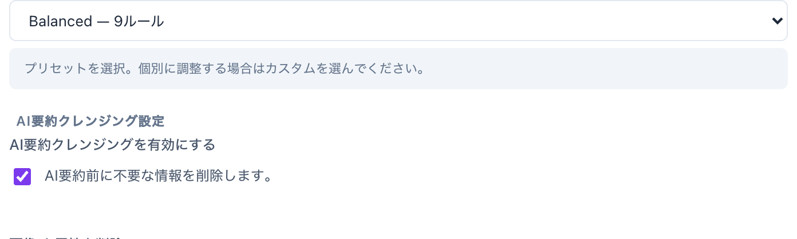
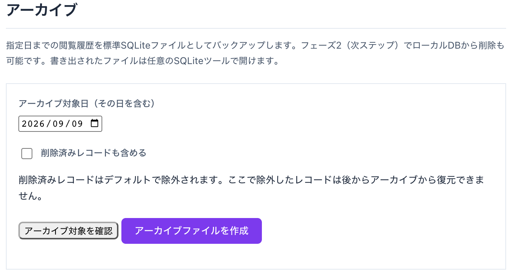

# Yasumaro を半年ぶりに触る人へ — v6.8 までに増えた4つの便利

Yasumaro は、ブラウザで読んだページを AI が要約して、Obsidian とローカルに自動で残していく Chrome / Edge 拡張機能です。

もともとこの拡張機能は「Obsidian Weave」という名前でした。v5 のころに名前を Yasumaro に変え、記録のしくみも作り直しています。以前は要約を Obsidian にそのまま流し込むだけで、Obsidian を開いていないと記録がどこにも残らないことがありました。いまは拡張機能の中に SQLite のデータベースを持っていて、Obsidian を使っていなくても要約と履歴がたまり続けます。Obsidian への書き込みは、その上に乗る「送り先の一つ」という位置づけになりました。改名の由来と設計を変えた理由は [Obsidian Weave から Yasumaro へ（Zenn）](https://zenn.dev/ar1/articles/yasumaro-02-from-weave-to-yasumaro) にまとめています。

しくみはシンプルです。ページをある程度読んでいたと判断すると、本文を抜き出して AI に要約させ、タイトル・URL・日付・要約をまとめて Obsidian の Vault に Markdown で書き込みます。同じ内容は拡張機能内のローカル履歴にも残るので、Obsidian を開かなくても後から検索できます。ボタンを押す必要はなく、読んだそばから勝手に貯まっていきます。「あの記事どこで読んだんだっけ」を減らすための道具です。

導入まわりで一つ朗報です。Edge を使っている人は、[Edge アドオンストア](https://microsoftedge.microsoft.com/addons/detail/yasumaro-ai-browsing-lo/cajkdicmjjpmmohmiodmilmgkaeeonep) からボタン一つで入れられるようになりました。GitHub から zip を落として展開して読み込ませて…という手順はもう要りません。更新も自動です。Chrome の人は、ウェブストアの公開を止めているぶん、これまで通り GitHub からになります（手順は末尾）。

しばらく使っていなかった人向けに、v6.6 から v6.8 のあいだで「体験として変わったところ」を4つだけ紹介します。細かいバグ修正はたくさんありますが、ここでは日々の使い勝手に効くものに絞ります。

- APIキーがなくても AI 要約が動くようになった
- 要約から「ゴミ」がもっと消えるようになった
- 古い履歴を安心して片付けられるようになった
- 「接続テスト」が実際に効くようになった

以下、それぞれを詳しく見ていきます。

---

# 1. ブラウザだけで AI 要約 — APIキーの登録がいらなくなった

Yasumaro の AI 要約には、これまで OpenAI や Gemini などの API キーが要りました。キーを取るのが面倒で、要約は使わないままだった人もいると思います。

v6.7 からは、Chrome や Microsoft Edge に入っている AI をそのまま使えます。設定でプロバイダーに「Built-in AI」を選ぶだけ。キーは要りません。要約はパソコンの中で完結するので、ページの中身がどこかに送られる心配もありません。

## 何が要らなくなったか

- API キーの登録
- 料金の心配（無料）
- ネットワーク（初回のダウンロード後はオフラインで動く）

要約はパソコンの中だけで行われるので、読んでいるページの中身が外に送られることもありません。

## 使い方

1. ダッシュボードの AI プロバイダー設定で「Built-in AI」を選ぶ
2. 「AI テスト」ボタンを押す
3. 初回はモデルのダウンロードが始まる（数分）
4. ダウンロードが終われば、以降は自動で要約に使われる

対応ブラウザで最初に一度だけ、設定画面（フラグ）を切り替えます。手順はセットアップガイドに書いてあります。うまくいかないときは、ダッシュボードの「診断」パネルを開けば、いまダウンロード待ちなのか、準備ができているのかが分かります。

## 正直なところ

クラウドの AI（OpenAI や Gemini）と比べると遅いです。要約もあっさりめ。M1 の Mac だと 1 ページ 30 秒くらいかかることもあります。

それでも困らないのは、Yasumaro の記録がうしろで静かに進むからです。画面の前で待つ必要はありません。読み終えて少し経つと、Obsidian に要約が入っています。

## どんな人に向くか

- API キーを取るのが面倒な人
- 料金を気にせず使いたい人
- ページの中身を外部の AI に渡したくない人

速さと要約の濃さがほしいなら、これまで通りクラウドの AI がおすすめです。両方登録しておき、片方が使えないときにもう片方へ自動で切り替える、という設定もできます。

---

# 2. 要約が「本文だけ」に近づいた — クレンジングの強化

要約の前に、広告や定型文などのノイズを取り除く処理が入っています。この「掃除」（クレンジング）が v6.7 で強くなりました。

## プリセットを選ぶだけ

これまでは細かいトグルがたくさんあって、どれを入れればいいか分かりにくいものでした。

いまは3つのプリセットから選べます。

- **最小** — 広告と画像の代替テキスト、ナビゲーションだけを消す
- **バランス** — さらに SNS ボタン、おすすめ記事、ポップアップ、Cookie バナーなどを消す（初期設定）
- **強め** — ほぼ全部消す

まず「バランス」で使ってみて、物足りなければ「強め」に、消えすぎるなら「最小」に、という調整で十分です。

## あるサイトだけ調整できる

特定のサイトで毎回うまく掃除できないとき、そのサイトだけ設定を変えられます。ダッシュボードのクレンジング設定でドメインを追加して、そのドメイン用のトグルをいじるだけです。

サブドメインは別サイト扱いになります。`example.com` の設定は `blog.example.com` には効きません。

## 「Cookie を許可しますか」が消えるようになった

サイトを開くと出てくる「このサイトは Cookie を使用します。同意しますか」というバナー。あの文章が要約に混ざることがありました。

いまは自動で取り除かれます（バランス以上のプリセット）。

## 消えすぎたら報告できる

掃除が効きすぎて、肝心の本文まで消えてしまうことがあります。

そのときは popup の「誤削除を報告」ボタンを押すだけです。何がどれだけ消えたかが手元に記録されます。この記録はパソコンの中だけに残り、どこにも送信されません。あとで自分が設定を見直すための材料です。

## 消えた量が見える

ダッシュボードのクレンジング設定パネルで、「何がどの理由で、いくつ消されたか」を件数で確認できます。掃除の前と後のテキストを見比べることもできます。

「ちゃんと本文だけ残っているか」を自分の目で確かめられるので、安心して強めの設定を使えます。

---

# 3. 古い履歴を「箱にしまう」機能 — アーカイブ

Yasumaro を使い続けると、閲覧履歴がどんどん溜まっていきます。古いぶんをファイル（`.db`）に書き出して、本体から外せるようになりました。

正直に言うと、急いで使う機能ではありません。手元では 4000 件くらい溜まっていても、検索も表示も引っかかりを感じません。ブラウザ内蔵 AI で要約するときの方がよほど重いです。数万件を超えて動作が気になってきたとき、または「読んだ記録をまるごとどこかに保管しておきたい」ときのための機能だと思ってください。

## 手順は2段階

`Dashboard → Archive` パネルを開きます。

### 1. アーカイブファイルを作る

- 日付を選ぶと、それより前の履歴が何件あるか表示されます（スター付き・削除済みの内訳も出ます）
- 「Create archive file」を押すと、`yasumaro_archive_日付.db` というファイルができてダウンロードされます
- **この時点では、本体の履歴はそのままです**

### 2. 本体から消す

- ファイルがちゃんとダウンロードできたのを確認してから、「Delete records from main database」を押します
- 消えるのは、さっき作ったファイルに入っているぶんだけです
- ファイルを作ったあとに新しく記録したページは消えません

「バックアップができてから消す」という順番なので、いきなりデータを失う心配がありません。

## あとから戻せる

書き出したファイルは、いつでも本体に戻せます。「Restore from archive」でファイルを選ぶだけです。すでにある履歴は残り、重複はスキップされます。

## 開いて中身を見られる

本体に戻さなくても、アーカイブファイルをそのまま開いて中を検索したり、タイトルを直したりできます。「Open archive session」です。直した内容はアーカイブファイルに保存されます。

## 注意

アーカイブファイルは暗号化されていません。ふつうの SQLite ファイルなので、DB Browser for SQLite のようなツールでも開けます。

書き出したファイルの保管場所には気をつけてください。中身は閲覧履歴そのものです。

---

# 4. 「接続テスト」が本物になった

AI の設定画面には「接続テスト」ボタンがあります。設定が正しいかを確かめるためのものです。これが v6.7 で、ようやくちゃんとしたテストになりました。

## 前は何がダメだったか

以前のテストは、AI サービスに「つながるか」だけを見ていました。

だから、テストが緑になっても、本番でページを要約すると中身が空、ということが起きました。キーは通っているのに要約には使えない。モデル名が微妙に違う。そうしたズレを、旧テストは見つけられなかったのです。

## いまはどうなったか

テストボタンを押すと、実際に AI へ短い文章を投げます。そして返ってきた内容をその場で表示します。

画面に出るもの:

- どこに送ったか
- 何を送ったか
- 何が返ってきたか
- エラーが出た場合はその内容
- モデル名、かかった時間

テストが通れば、本番でも要約が動く。当たり前のことですが、これまではそうなっていませんでした。

## 遅くても進捗が見える

AI を複数登録していると、上から順にテストします。いまどれをテスト中で、何秒経ったかが出ます。内蔵 AI のように返事が遅いものでも、固まっているのか処理中なのかが分かります。

## 失敗したときに原因が分かる

うまくいかないとき、画面の表示から見当がつきます。

- 「401」なら API キーの問題
- 「404」ならモデル名の問題
- 「つながった、でも返事が空」なら、AI 側の設定（出力できる長さなど）の問題

これまでは「赤くなった」しか分からなかったので、原因を探すのが大変でした。

---

# 戻ってくる人へ

v6.6 系からそのまま v6.8 系に上げて大丈夫です。設定は引き継がれます。さらに前の Obsidian Weave からでも、初回起動時に古い履歴が自動で新しいデータベースへ移ります。手作業の移行は不要です。

内蔵 AI を使いたい場合だけ、対応ブラウザでの準備（フラグの有効化とモデルのダウンロード）が必要です。詳しい手順はセットアップガイドにあります。

## インストール方法

### Chrome を使っている人へ

事情があって、Chrome ウェブストアでの公開は現在停止しています（将来的に再開する可能性はあります）。当面は GitHub からダウンロードしてインストールしてください。

1. [最新リリース](https://github.com/armaniacs/yasumaro/releases/latest) から `yasumaro-<version>-chrome.zip` をダウンロードして展開します
2. `chrome://extensions` を開き、右上の「デベロッパーモード」をオンにします
3. 「パッケージ化されていない拡張機能を読み込む」から、展開したフォルダを選びます

### Edge を使っている人へ

Edge なら [Edge アドオンストア](https://microsoftedge.microsoft.com/addons/detail/yasumaro-ai-browsing-lo/cajkdicmjjpmmohmiodmilmgkaeeonep) からそのままインストールできます。

---

配布ページはこちら → [Yasumaro（GitHub）](https://github.com/armaniacs/yasumaro)

Obsidian Weave からの経緯はこちら → [Obsidian Weave から Yasumaro へ（Zenn）](https://zenn.dev/ar1/articles/yasumaro-02-from-weave-to-yasumaro)

技術的な話や過去のリリース解説は Zenn にまとめています → [Zenn の yasumaro トピック](https://zenn.dev/topics/yasumaro)
