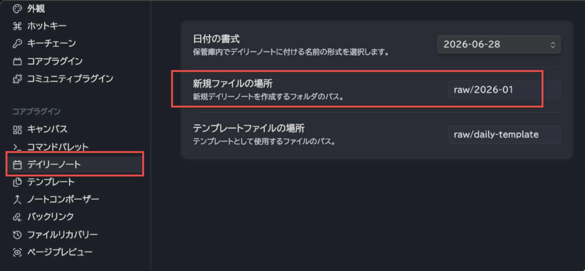
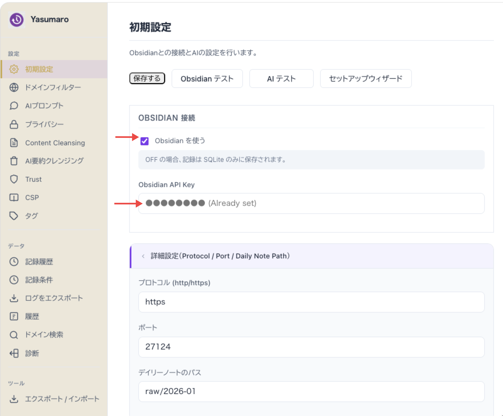

# Obsidian 連携ガイド / Obsidian Integration Guide

[日本語](#日本語) | [English](#english)

---

## 日本語

### 目次

1. [前提条件](#前提条件)
2. [Local REST API with MCP プラグインのインストール](#local-rest-api-with-mcp-プラグインのインストール)
3. [APIキーのコピー](#apiキーのコピー)
4. [プロトコルとポートの確認](#プロトコルとポートの確認)
5. [Daily Note Pathの設定](#daily-note-pathの設定)
6. [Yasumaroダッシュボードへの入力と接続テスト](#yasumaroダッシュボードへの入力と接続テスト)
7. [トラブルシューティング](#トラブルシューティング)

---

### 前提条件

このガイドを始める前に、以下がそろっていることを確認してください。

| 必要なもの | 確認方法 |
| :--- | :--- |
| **Obsidian** がインストール済み | アプリが起動できる |
| **Obsidian Vault** が作成済み | Obsidianを開くとファイル一覧が表示される |
| **Yasumaro** が Chrome にインストール済み | ツールバーに Yasumaro のアイコンが表示される |
| **Google Chrome** ブラウザを使用中 | — |

Obsidianをまだインストールしていない場合は [obsidian.md](https://obsidian.md/) からダウンロードしてください。Yasumaroのインストールは [Chrome Web Store](https://chromewebstore.google.com/detail/yasumaro-ai-browsing-logg/cpeammcnmfpmlkidciiobmnjnhfkmjlc) から行えます。

---

### Local REST API with MCP プラグインのインストール

YasumaroがObsidianにアクセスするには、Obsidian側に **Local REST API** プラグインが必要です。これはObsidianの公式コミュニティプラグインとして提供されています。

> **プラグイン名について**: このプラグインは以前「Local REST API」という名称でしたが、現在は **「Local REST API with MCP」** に改名されています（[GitHubリポジトリ](https://github.com/coddingtonbear/obsidian-local-rest-api)）。プラグイン一覧では新しい名称で検索してください。

**手順:**

1. Obsidianを開き、左下の **設定（歯車アイコン）** をクリックします

2. 左メニューから **「コミュニティプラグイン」** を選択します

3. 初回の場合は「制限モードをオフにする」ボタンが表示されます。クリックして有効化します

   > コミュニティプラグインを使用するためにこの操作が必要です。公式のObsidianコミュニティが管理するプラグインのみを対象としています。

4. **「閲覧」** ボタンをクリックして、プラグイン一覧を開きます

5. 検索欄に **「Local REST API with MCP」** と入力します

6. **「Local REST API with MCP」**（作者: Adam Coddington）をクリックし、**「インストール」** を押します

   

7. インストール完了後、**「有効化」** をクリックします

   > 有効化しないと Yasumaro からアクセスできません。インストール直後に有効化を忘れがちなので注意してください。

---

### APIキーのコピー

プラグインが有効化されると、固有のAPIキーが自動生成されます。

**手順:**

1. Obsidianの **設定** を開きます

2. 左メニューの下部（「コミュニティプラグイン」の下）に **「Local REST API with MCP」** が表示されています。クリックします

3. **「API Key」** は、"Bearer abcdefg....." のように 表示されています。冒頭の "Bearer " 部分を除いた場所がAPIキーになります。

   

   > APIキーは他人に教えないでください。このキーを持っている人は、あなたのObsidian Vaultを読み書きできます。

---

### プロトコルとポートの確認

Local REST APIプラグインはデフォルトで以下の設定で動作します。

| 設定 | デフォルト値 | 変更が必要なケース |
| :--- | :--- | :--- |
| **プロトコル** | `https` | 自己署名証明書エラーを回避したい場合は `http` |
| **ポート** | `27124` | 他のアプリとポートが競合している場合のみ変更 |

**基本的にはデフォルト（https / 27124）のままで問題ありません。** Yasumaroダッシュボードのデフォルト値もこれに合わせています。

ポートを変更した場合は、Obsidianの「Local REST API」設定画面でも同じポート番号に変更してください。

---

### Daily Note Pathの設定

YasumaroはObsidianの **デイリーノート** に記録を追記します。デイリーノートが保存されているフォルダのパスを設定する必要があります。

**確認方法:**

Obsidianで「デイリーノート」プラグインの設定を開き、「新しいノートの保存場所」に表示されているフォルダ名を確認します。

**設定例:**

| Vault内のフォルダ構成 | Daily Note Path に入力する値 |
| :--- | :--- |
| Vault直下（フォルダなし） | （空欄のまま） |
| `Journal/` フォルダ内 | `Journal` |
| `092.Daily/` フォルダ内 | `092.Daily` |
| `Notes/Daily/` フォルダ内 | `Notes/Daily` |
| `raw/2026-01/` フォルダ内 | `raw/2026-01` |

> Yasumaroは `{Daily Note Path}/{YYYY-MM-DD}.md` の形式でファイルを作成・追記します。日付ファイルが存在しない場合は自動的に作成されます。

 

この例では、 `raw/2026-01/2026-06-28.md` というファイルが作成されます。

---

### Yasumaroダッシュボードへの入力と接続テスト

準備が整ったので、Yasumaroに設定を入力します。

**手順:**

1. Chrome ツールバーの Yasumaro アイコンをクリックし、右上の **⚙ アイコン** からダッシュボードを開きます

2. **「初期設定」** パネルを確認します。「Obsidian を使う」を選択します。

3. **「Obsidian API Key」** フィールドに、手順2でコピーしたAPIキーを貼り付けます

4. 必要に応じて **「詳細設定」** を開き、以下を確認します
   - **プロトコル**: `https`（デフォルト）
   - **ポート**: `27124`（デフォルト）
   - **デイリーノートのパス**: 手順4で確認したフォルダパス

5. **「保存する」** をクリックします

6. **「Obsidian テスト」** ボタンをクリックして接続を確認します

   - ✅ 「接続成功」と表示されれば完了です
   - ❌ エラーが表示された場合は[トラブルシューティング](#トラブルシューティング)を参照してください

---

### トラブルシューティング

#### 証明書エラー（self-signed certificate）

`https` プロトコルで接続すると、Obsidian Local REST APIが自己署名証明書を使用しているため、初回はChromeが接続を拒否する場合があります。

**対処法A（推奨）: Chromeで証明書を一度許可する**

> この操作は **Obsidian Local REST API（ローカル環境のみ）** に対して行うものです。一般的なWebサイトの証明書警告を無視することとは異なります。

1. Chrome で `https://127.0.0.1:27124` を新しいタブで開きます
2. 「接続がプライベートではありません」などの警告が表示されます
3. **「詳細設定」** をクリックし、**「127.0.0.1 にアクセスする（安全でない）」** をクリックします
4. JSONデータが表示されれば証明書の許可は完了です
5. Yasumaroダッシュボードに戻り、再度「Obsidian テスト」を実行します

**対処法B: httpに切り替える**

証明書許可がうまくいかない場合は、`http` に変更することで回避できます。

1. Yasumaroダッシュボードの「詳細設定」でプロトコルを `http` に変更します
2. ポートは `27123`（httpのデフォルト）に変更します
3. Obsidianの「Local REST API」設定でも同じポートになっているか確認します

---

#### 接続タイムアウト / 接続できない

- **Obsidianが起動しているか確認**: Local REST APIはObsidianが起動している間だけ動作します
- **Local REST APIプラグインが有効化されているか確認**: 設定→コミュニティプラグインで「有効化済みプラグイン」に表示されているか確認します
- **ポート番号が一致しているか確認**: Yasumaroの設定とObsidianのLocal REST API設定のポートが同じか確認します

---

#### Daily Note Pathが正しく認識されない

- パスの先頭と末尾にスラッシュ（`/`）を付けないでください
  - ✅ 正しい: `Journal`
  - ❌ 間違い: `/Journal/`
- Vault直下に保存している場合は空欄のままにしてください
- フォルダ名は大文字・小文字を区別します。Obsidian内のフォルダ名と完全に一致させてください

---

完全なセットアップ手順（AI設定・ドメインフィルターなど）は [SETUP_GUIDE.md](SETUP_GUIDE.md) を参照してください。

---

## English

### Table of Contents

1. [Prerequisites](#prerequisites)
2. [Install Local REST API with MCP Plugin](#install-local-rest-api-with-mcp-plugin)
3. [Copy the API Key](#copy-the-api-key)
4. [Verify Protocol and Port](#verify-protocol-and-port)
5. [Set Daily Note Path](#set-daily-note-path)
6. [Enter Settings in Yasumaro and Test Connection](#enter-settings-in-yasumaro-and-test-connection)
7. [Troubleshooting](#troubleshooting)

---

### Prerequisites

Before starting this guide, make sure you have the following:

| Requirement | How to verify |
| :--- | :--- |
| **Obsidian** installed | The app launches successfully |
| **Obsidian Vault** created | Files are shown when Obsidian opens |
| **Yasumaro** installed in Chrome | Yasumaro icon is visible in the toolbar |
| **Google Chrome** browser | — |

If you haven't installed Obsidian yet, download it from [obsidian.md](https://obsidian.md/). Install Yasumaro from the [Chrome Web Store](https://chromewebstore.google.com/detail/yasumaro-ai-browsing-logg/cpeammcnmfpmlkidciiobmnjnhfkmjlc).

---

### Install Local REST API with MCP Plugin

Yasumaro needs the **Local REST API** plugin installed in Obsidian to communicate with it. This plugin is available in Obsidian's official community plugin directory.

> **Note on plugin name**: This plugin was previously named "Local REST API" but has since been renamed to **"Local REST API with MCP"** ([GitHub repository](https://github.com/coddingtonbear/obsidian-local-rest-api)). Search for the new name in the plugin directory.

**Steps:**

1. Open Obsidian and click the **Settings (gear icon)** at the bottom left

2. In the left menu, select **"Community plugins"**

3. If this is your first time, you'll see a "Turn off restricted mode" button. Click it to enable community plugins

   > This step is required to use community plugins. It only applies to plugins managed by the official Obsidian community.

4. Click the **"Browse"** button to open the plugin directory

5. Type **"Local REST API with MCP"** in the search box

   

6. Click **"Local REST API with MCP"** (by Adam Coddington) and press **"Install"**

   

7. After installation, click **"Enable"**

   > The plugin must be enabled for Yasumaro to connect. It's easy to forget this step right after installing.

---

### Copy the API Key

Once the plugin is enabled, a unique API key is automatically generated.

**Steps:**

1. Open Obsidian **Settings**

2. In the left menu, below "Community plugins", click **"Local REST API with MCP"**

3. Find the **"API Key"** field and click the copy icon on the right

   

   > Keep this API key private. Anyone who has it can read and write to your Obsidian Vault. Avoid exposing it during screen shares or in screenshots you publish.

---

### Verify Protocol and Port

The Local REST API plugin uses the following defaults:

| Setting | Default | When to change |
| :--- | :--- | :--- |
| **Protocol** | `https` | Switch to `http` if you get a self-signed certificate error |
| **Port** | `27124` | Only if another app conflicts with this port |

**In most cases, leave these at the defaults (https / 27124).** Yasumaro's dashboard defaults match these values.

If you change the port, update the same setting in Obsidian's Local REST API configuration.

---

### Set Daily Note Path

Yasumaro appends records to your Obsidian **Daily Notes**. You need to specify the folder where your daily notes are stored.

**How to find it:**

Open Obsidian's "Daily notes" core plugin settings and check the "New file location" field.

**Examples:**

| Vault folder structure | Value to enter in Daily Note Path |
| :--- | :--- |
| Vault root (no subfolder) | (leave empty) |
| `Journal/` folder | `Journal` |
| `092.Daily/` folder | `092.Daily` |
| `Notes/Daily/` folder | `Notes/Daily` |
| `raw/2026-01/` folder | `raw/2026-01` |

> Yasumaro creates or appends to `{Daily Note Path}/{YYYY-MM-DD}.md`. The file is created automatically if it doesn't exist.

---

### Enter Settings in Yasumaro and Test Connection

Now enter your settings in Yasumaro.

**Steps:**

1. Click the Yasumaro icon in the Chrome toolbar, then click the **⚙ icon** (top right) to open the dashboard

2. Go to the **"General Settings"** panel

3. Paste the API key you copied in step 2 into the **"Obsidian API Key"** field

4. If needed, open **"Advanced Settings"** and confirm:
   - **Protocol**: `https` (default)
   - **Port**: `27124` (default)
   - **Daily Note Path**: the folder path from step 4

5. Click **"Save"**

6. Click **"Test Obsidian"** to verify the connection

   - ✅ "Connection successful" means you're all set
   - ❌ If an error appears, see [Troubleshooting](#troubleshooting) below

---

### Troubleshooting

#### Certificate Error (self-signed certificate)

When using `https`, Chrome may block the connection on first use because Obsidian Local REST API uses a self-signed certificate.

**Fix A (recommended): Allow the certificate in Chrome once**

> This applies only to the **Obsidian Local REST API (local environment)**. This is not the same as ignoring certificate warnings on general websites.

1. Open `https://127.0.0.1:27124` in a new Chrome tab
2. You'll see a "Your connection is not private" warning
3. Click **"Advanced"**, then click **"Proceed to 127.0.0.1 (unsafe)"**
4. If you see JSON data, the certificate is now trusted
5. Return to the Yasumaro dashboard and run "Test Obsidian" again

**Fix B: Switch to http**

If Fix A doesn't work, you can avoid the certificate issue by switching to `http`.

1. In Yasumaro's "Advanced Settings", change the protocol to `http`
2. Change the port to `27123` (the default http port for Local REST API)
3. Confirm the same port is set in Obsidian's Local REST API settings

---

#### Connection Timeout / Cannot Connect

- **Check that Obsidian is running**: Local REST API only works while Obsidian is open
- **Check that the plugin is enabled**: Go to Settings → Community plugins and confirm "Local REST API" appears under "Enabled plugins"
- **Check that ports match**: Confirm the port in Yasumaro and the port in Obsidian's Local REST API settings are identical

---

#### Daily Note Path Not Recognized

- Do not add leading or trailing slashes
  - ✅ Correct: `Journal`
  - ❌ Wrong: `/Journal/`
- If your notes are in the vault root, leave the field empty
- Folder names are case-sensitive. Match the exact capitalization used in Obsidian

---

For the full setup guide (AI provider settings, domain filters, etc.), see [SETUP_GUIDE.md](SETUP_GUIDE.md).
