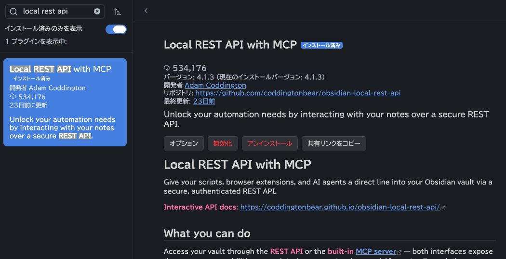
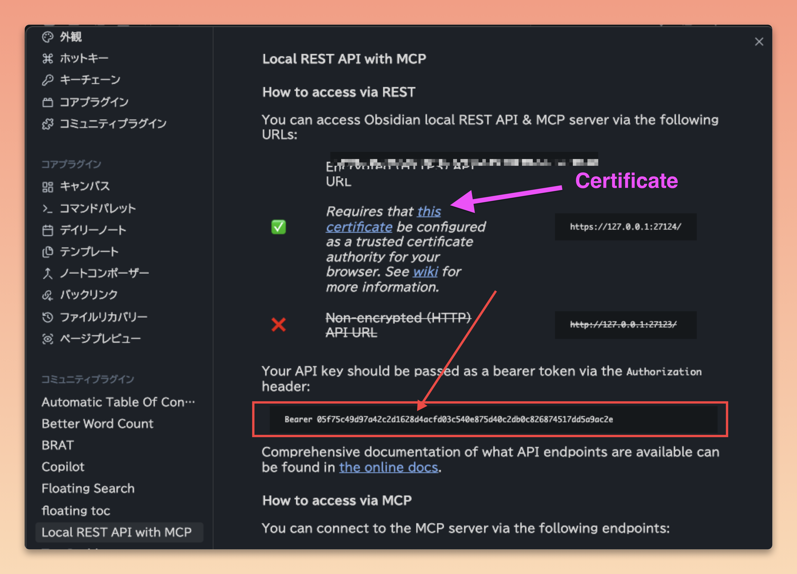

# Obsidian 連携ガイド / Obsidian Integration Guide

[日本語](#日本語) | [English](#english)

---

## 日本語

Yasumaro は、あなたが Chrome で閲覧した Web ページの情報を、自動的に Obsidian のデイリーノートへ書き込む拡張機能です。この連携を実現するには、Obsidian 側で「Local REST API」というコミュニティプラグインを導入し、そのプラグインが発行する API キーを Yasumaro ダッシュボードに登録する必要があります。設定はおよそ5〜10分で完了します。

このガイドを始める前に、[Obsidian](https://obsidian.md/) と Vault（ノートの保管庫）がすでに作成されていること、[Yasumaro Chrome 拡張機能](https://chromewebstore.google.com/detail/yasumaro-ai-browsing-logg/cpeammcnmfpmlkidciiobmnjnhfkmjlc)が Chrome にインストール済みであることを確認してください。

---

### 1. Local REST API プラグインのインストール

Obsidian を開き、左下の **設定 ⚙️** をクリックします。左サイドバーの **コミュニティプラグイン** を選び、**閲覧** ボタンを押してプラグインストアを開きます。検索バーに `Local REST API` と入力すると該当のプラグインが表示されるので、**インストール** をクリックしてください。

インストールが完了したら、そのまま **有効化** をクリックします。有効化しないと API キーが生成されないため、必ずこの操作を忘れずに行ってください。

---

### 2. 証明書をブラウザにインストール

Local REST API プラグインは、Obsidian とブラウザが安全に通信するための自己署名証明書を自動生成します。この証明書を Chrome に登録しておかないと、後の接続テストで警告が出たり通信が失敗したりすることがあります。

プラグイン設定画面に表示される **Certificate** のダウンロードボタンをクリックして、証明書ファイルを保存してください。

ダウンロードしたファイルをダブルクリックすると「証明書のインポート」ダイアログが開きます。**次へ** を押し、**証明書ストアの場所** で **信頼できるルート証明機関** を選択して、**次へ** → **完了** の順にクリックすれば登録完了です。

---

### 3. API キーのコピー

証明書のインストールが終わったら、次は API キーをコピーします。プラグイン設定画面の **API Key** フィールドに表示されている文字列が対象です。"Bearer" という語は含まず、その後ろの部分だけをコピーしてください。

この API キーは Yasumaro が Obsidian に書き込む際の認証に使われます。第三者に漏れると Obsidian Vault への不正アクセスにつながる可能性があるため、スクリーンショットや共有ドキュメントへの貼り付けは避けてください。万が一漏洩した場合は、プラグイン設定画面の **Regenerate API Key** ボタンで新しいキーを発行できます。

---

### 4. プロトコルとポートの確認

通常はデフォルトのままで動作します。Yasumaro ダッシュボードに入力する URL は `https://127.0.0.1:27124` です。ポート `27124` は https 用、`27123` は http 用です。他のアプリケーションとポートが競合している場合にのみ変更してください。

---

### 5. Daily Note Path の設定

Yasumaro は記録を「今日のデイリーノート」に追記します。そのため、あなたの Vault 内でデイリーノートが保存されているフォルダのパスを、プラグイン設定の **Daily Note Path** フィールドに入力する必要があります。

Obsidian 標準の Daily Notes プラグインを使用している場合は、Obsidian 設定 → **デイリーノート** → **新規作成場所** に表示されているフォルダ名を確認してください。たとえば `DailyNotes` フォルダを使っているなら `DailyNotes` と入力します。`Journal` や `092.Daily` のように独自のフォルダ名にしている場合はそのまま入力してください。パスは Vault ルートからの相対パスで、先頭のスラッシュ `/` は不要です。

---

### 6. Yasumaro ダッシュボードへの入力と接続テスト

Chrome の Yasumaro 拡張機能アイコンを右クリックして **オプション** を選ぶと、ダッシュボードが開きます。「初期設定」パネルで **Obsidian を使う** チェックボックスをオンにすると、入力フィールドが表示されます。

| フィールド | 入力値 |
|----------|--------|
| **Obsidian の URL** | `https://127.0.0.1:27124`（デフォルト） |
| **Obsidian API Key** | 手順3でコピーした API キー |
| **Daily Note Path** | 手順5で確認したフォルダ名（例: `DailyNotes`） |

入力が終わったら **接続テスト** ボタンをクリックしてください。「✓ 接続成功」と表示されれば設定完了です。Obsidian が起動していない状態でテストすると必ず失敗するため、テスト前に Obsidian が起動していることを確認してください。

---

### トラブルシューティング

#### 証明書エラー（self-signed certificate）が出る場合

手順2の証明書インストールが済んでいても、Chrome が初回接続時に「この接続ではプライバシーが保護されません」という警告を表示することがあります。これは Obsidian Local REST API が自己署名証明書を使用しているためで、悪意のある通信が発生しているわけではありません。

対処するには、Chrome のアドレスバーに `https://127.0.0.1:27124` を直接入力してアクセスします。警告画面が表示されたら **詳細設定** をクリックし、**「127.0.0.1 にアクセスする（安全でない）」** を選んでください。この操作により Chrome がローカル証明書を記憶し、以降は Yasumaro からの接続が通るようになります。

なお、この操作はあくまでローカル環境の Obsidian に対してのみ行うものです。インターネット上の一般サイトで同様の警告が出た場合は、**絶対に無視しないでください**。

それでも証明書エラーが解消しない場合は、Yasumaro ダッシュボードのプロトコルを `http`、ポートを `27123` に変更してください。http は証明書検証を行わないため接続できるようになりますが、通信が暗号化されないことに留意してください（ただし通信先は `127.0.0.1` つまり自分のPC内部だけなので、実用上のリスクは限定的です）。

#### 接続テストがタイムアウトする場合

Obsidian が起動しているか、Local REST API プラグインが有効になっているかを確認してください。URL とポート番号の入力ミスも多い原因のひとつです。macOS や Windows のファイアウォール設定でポート `27124` がブロックされている場合も同様の症状が出ます。

#### Daily Note Path が正しく認識されない場合

Vault のルートフォルダからの相対パスを入力してください。先頭に `/` を付けると認識されません。また、日本語のフォルダ名を使用している場合は、Obsidian 上のフォルダ名と完全に一致しているかを確認してください。Obsidian の Daily Notes プラグイン設定で「新規作成場所」として指定しているフォルダ名と同じ文字列を入力するのが確実です。

---

### 参考リンク

- [Local REST API プラグイン（GitHub）](https://github.com/coddingtonbear/obsidian-local-rest-api)
- [Yasumaro Chrome Web Store ページ](https://chromewebstore.google.com/detail/yasumaro-ai-browsing-logg/cpeammcnmfpmlkidciiobmnjnhfkmjlc)
- [Yasumaro GitHub リポジトリ](https://github.com/armaniacs/yasumaro)

---

## English

To enable Yasumaro to automatically save web page information to Obsidian, you need to set up the Local REST API plugin in Obsidian and register the API key in the Yasumaro dashboard. This guide walks through each step with screenshots.

**Estimated time**: ~5-10 minutes

### Prerequisites

- [Obsidian](https://obsidian.md/) installed
- An Obsidian Vault created (created on first launch)
- [Yasumaro Chrome Extension](https://chromewebstore.google.com/detail/yasumaro-ai-browsing-logg/cpeammcnmfpmlkidciiobmnjnhfkmjlc) installed
- Google Chrome browser

---

### 1. Install the Local REST API Plugin

Install the Local REST API plugin from the Obsidian community plugin store.

1. Open Obsidian and click **Settings ⚙️** in the bottom-left corner.
2. In the left sidebar, go to **Community Plugins** → **Browse**.
3. Type `Local REST API` in the search bar.

   

4. Click **Install** on the "Local REST API" plugin.
5. After installation, click **Enable**.

   

---

### 2. Copy the API Key

Copy the API key generated by the plugin. This key authenticates communication between Yasumaro and Obsidian.

1. Confirm that **Local REST API** now appears in the left sidebar of Obsidian settings.
2. Click **Local REST API**.
3. Copy the value in the **API Key** field (a UUID in `xxxxxxxx-xxxx-xxxx-xxxx-xxxxxxxxxxxx` format).

   

> **Note**: The API key is sensitive information. Do not share it with third parties. If the key is leaked, you can regenerate it using the **Regenerate API Key** button in the plugin settings.

---

### 3. Verify Protocol and Port

The default settings work for most cases. Verify these default values:

| Setting | Default Value | Notes |
|---------|--------------|-------|
| **Protocol** | `https` | https recommended for security |
| **Port** | `27124` | Default port for https |
| **HTTP Port** | `27123` | Only when using http |

**When to change settings**:
- Only change if port `27124` conflicts with another application
- Most environments can use the defaults

---

### 4. Configure Daily Note Path

Set the location where Yasumaro saves web page records.

1. Go to Obsidian Settings → **Local REST API**.
2. In the **Daily Note Path** field, enter the path to your daily notes within your Vault.

Examples:

| Vault Structure | Daily Note Path Value |
|----------------|----------------------|
| Standard Daily Notes (`DailyNotes/2026-06-29.md`) | `DailyNotes` |
| `Journal` folder with date format | `Journal` |
| `092.Daily` folder | `092.Daily` |

Match the path to your Daily Note plugin settings. If using Obsidian's built-in Daily Notes plugin, enter the folder name specified in the "New file location" setting.

---

### 5. Configure Yasumaro Dashboard and Test Connection

1. Right-click the Yasumaro extension icon in Chrome → select **Options** to open the dashboard.
2. In the "Initial Settings" panel, check **Use Obsidian**.
3. Enter the following:

   | Field | Value |
   |-------|-------|
   | **Obsidian URL** | `https://127.0.0.1:27124` (default) |
   | **Obsidian API Key** | The API key copied in step 2 |
   | **Daily Note Path** | The path configured in step 4 (e.g., `DailyNotes`) |

4. Click **Test Connection**.
5. You should see ✓ Connection successful.

---

### Troubleshooting

#### Certificate Error (Self-Signed Certificate)

The Local REST API plugin uses a self-signed certificate by default, which may trigger a Chrome certificate warning on the first connection.

**Steps to resolve (macOS / Windows)**:

1. Open `https://127.0.0.1:27124` in Chrome.
2. You will see a "Your connection is not private" warning.
3. Click **Advanced**.
4. Click **Proceed to 127.0.0.1 (unsafe)**.

This tells Chrome to trust this local certificate for future connections from Yasumaro.

> **Important**: This action is specific to the Obsidian Local REST API, a local-only tool. **Never** ignore certificate warnings for general websites on the internet.

**If the certificate error persists**:
- Switch the protocol to `http` and port to `27123` in the Yasumaro dashboard (http does not perform certificate validation)
- Note that http traffic is unencrypted, so be mindful of local network security

#### Connection Timeout

If the test connection times out:

1. Ensure Obsidian is running.
2. Verify the Local REST API plugin is enabled.
3. Check that the URL and port are correct (default: `https://127.0.0.1:27124`).
4. Check if a firewall is blocking port `27124`.

#### Daily Note Path Not Recognized

1. Check the "New file location" setting in Obsidian's Daily Notes plugin configuration.
2. Ensure the path is relative to the Vault root (no leading `/`).
3. If using Japanese folder names, verify the folder name is correct.

---

### Reference Links

- [Local REST API Plugin (GitHub)](https://github.com/coddingtonbear/obsidian-local-rest-api)
- [Yasumaro on Chrome Web Store](https://chromewebstore.google.com/detail/yasumaro-ai-browsing-logg/cpeammcnmfpmlkidciiobmnjnhfkmjlc)
- [Yasumaro GitHub Repository](https://github.com/armaniacs/yasumaro)
